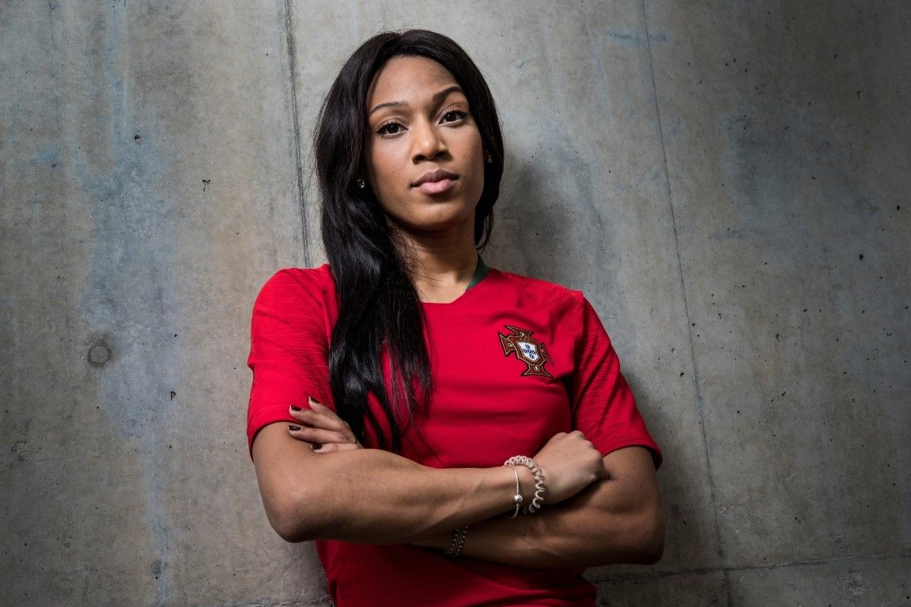

[facebook](https://www.facebook.com/sharer/sharer.php?u=https%3A%2F%2Fwww.natgeo.pt%2Fviagem-e-aventuras%2F2019%2F08%2Fentrevista-a-patricia-mamona-a-melhor-atleta-portuguesa-de-triplo-salto) [twitter](https://twitter.com/share?url=https%3A%2F%2Fwww.natgeo.pt%2Fviagem-e-aventuras%2F2019%2F08%2Fentrevista-a-patricia-mamona-a-melhor-atleta-portuguesa-de-triplo-salto&via=natgeo&text=Entrevista%20a%20Patr%C3%ADcia%20Mamona%2C%20a%20Melhor%20Atleta%20Portuguesa%20de%20Triplo%20Salto) [whatsapp](https://web.whatsapp.com/send?text=https%3A%2F%2Fwww.natgeo.pt%2Fviagem-e-aventuras%2F2019%2F08%2Fentrevista-a-patricia-mamona-a-melhor-atleta-portuguesa-de-triplo-salto) [flipboard](https://share.flipboard.com/bookmarklet/popout?v=2&title=Entrevista%20a%20Patr%C3%ADcia%20Mamona%2C%20a%20Melhor%20Atleta%20Portuguesa%20de%20Triplo%20Salto&url=https%3A%2F%2Fwww.natgeo.pt%2Fviagem-e-aventuras%2F2019%2F08%2Fentrevista-a-patricia-mamona-a-melhor-atleta-portuguesa-de-triplo-salto) [mail](mailto:?subject=NatGeo&body=https%3A%2F%2Fwww.natgeo.pt%2Fviagem-e-aventuras%2F2019%2F08%2Fentrevista-a-patricia-mamona-a-melhor-atleta-portuguesa-de-triplo-salto%20-%20Entrevista%20a%20Patr%C3%ADcia%20Mamona%2C%20a%20Melhor%20Atleta%20Portuguesa%20de%20Triplo%20Salto) [A disseminação global do coronavírus está a afetar os viajantes. Mantenha-se atualizado sobre a explicação científica por trás do surto >>](https://www.natgeo.pt/coronavirus) 

[Viagem e Aventuras](https://www.natgeo.pt/viagem-e-aventuras) 
# Entrevista a Patrícia Mamona, a Melhor Atleta Portuguesa de Triplo Salto 
## Finalista de triplo salto olímpica, campeã europeia e recordista nacional de triplo salto, Patrícia Mamona promete continuar a empenhar-se em saltar mais além. Por [National Geographic](https://www.natgeo.pt/autor/national-geographic) Publicado 30/08/2019, 13:58 

Entrevistámos a melhor atleta portuguesa de triplo salto, Patrícia Mamona. Fotografia por Federação PortuguESA de Futebol A sua dedicação ao atletismo começou quando tinha 13 anos, mas foi apenas aos 22 que percebeu que se queria dedicar ao triplo salto. E é disto que gosta. **Patrícia Mamona** estudou medicina nos Estados Unidos, altura em que competiu no circuito universitário americano. 

Em 2012, a atleta do Sporting Clube de Portugal ganhou a medalha de prata nos Europeus de atletismo, em Helsínquia. Nos Jogos Olímpicos de 2016, bateu o recorde nacional no triplo salto com a marca de **14.65 metros** , **** no Rio de Janeiro. Ainda nesse ano prodigioso para a carreira da triplista portuguesa, Patrícia recebeu a medalha de ouro em triplo salto no Campeonato Europeu de Atletismo. 

Mais tarde recebeu a insígnia de Comendadora da Ordem do Mérito. Em Tóquio espera fazer melhor ainda, nos jogos olímpicos de 2020. 

**Tem alguma memória de infância preferida?** 

Jogar descalça ao jogo do “35” (um jogo bastante dinâmico em que se corre e salta) com os meus amigos de infância no pátio do meu prédio. Chegar a casa com os pés todos sujos e levar um raspanete da minha mãe, mas com um sentimento de felicidade por ter tido um dia espetacular de brincadeira. 

**Qual a próxima meta?** 

Jogos Olímpicos de Tóquio! 

**Que preocupações carrega nos ténis?** 

Não é apenas uma preocupação, mas também uma responsabilidade de representar Portugal dar melhor forma possível nos campeonatos desportivos mais importantes como os Jogos Olímpicos e Campeonatos do Mundo. 

**O que a faz ir mais além?** 

O desejo de ser melhor e querer mais. 

**Se pudesse pedir um desejo para o Planeta, qual seria?** 

Que ninguém neste planeta passe fome. 

**CURIOSIDADES 

Cresceu em…** Lisboa 

**O seu herói é…** não tenho. Tenho pessoas que admiro, principalmente quando o seu trabalho está em constante superação, isso deixa-me inspirada e motivada no meu próprio trabalho. Se elas conseguem superar-se porque é que eu não hei de me superar? 

**Num dia típico…** treino, recupero, como uma tapioca com banana e vejo anime. 

**Para se divertir…** gosto de dançar. 

**O seu sítio preferido no mundo é…** em casa com a família. 

**Não consegue saltar sem…** tomar um café expresso 

**O seu melhor conselho é…** não deixes que ninguém te diga que não consegues. Se acreditas, vai! (P.S. e mostra-lhes o contrário) 

[source](https://www.natgeo.pt/viagem-e-aventuras/2019/08/entrevista-a-patricia-mamona-a-melhor-atleta-portuguesa-de-triplo-salto)