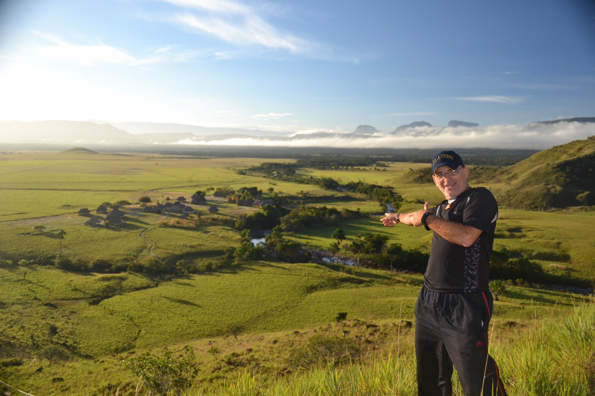
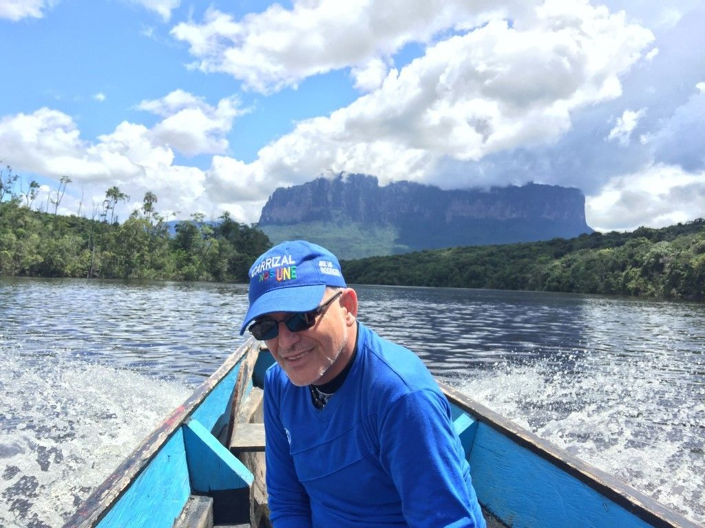

[facebook](https://www.facebook.com/sharer/sharer.php?u=https%3A%2F%2Fwww.natgeo.pt%2Fviagem-e-aventuras%2F2019%2F09%2Fentrevista-ao-tarzan-portugues-antonio-pestana-drumond) [twitter](https://twitter.com/share?url=https%3A%2F%2Fwww.natgeo.pt%2Fviagem-e-aventuras%2F2019%2F09%2Fentrevista-ao-tarzan-portugues-antonio-pestana-drumond&via=natgeo&text=Entrevista%20ao%20%E2%80%98Tarzan%E2%80%99%20Portugu%C3%AAs%20%E2%80%93%20Ant%C3%B3nio%20Pestana%20Drumond) [whatsapp](https://web.whatsapp.com/send?text=https%3A%2F%2Fwww.natgeo.pt%2Fviagem-e-aventuras%2F2019%2F09%2Fentrevista-ao-tarzan-portugues-antonio-pestana-drumond) [flipboard](https://share.flipboard.com/bookmarklet/popout?v=2&title=Entrevista%20ao%20%E2%80%98Tarzan%E2%80%99%20Portugu%C3%AAs%20%E2%80%93%20Ant%C3%B3nio%20Pestana%20Drumond&url=https%3A%2F%2Fwww.natgeo.pt%2Fviagem-e-aventuras%2F2019%2F09%2Fentrevista-ao-tarzan-portugues-antonio-pestana-drumond) [mail](mailto:?subject=NatGeo&body=https%3A%2F%2Fwww.natgeo.pt%2Fviagem-e-aventuras%2F2019%2F09%2Fentrevista-ao-tarzan-portugues-antonio-pestana-drumond%20-%20Entrevista%20ao%20%E2%80%98Tarzan%E2%80%99%20Portugu%C3%AAs%20%E2%80%93%20Ant%C3%B3nio%20Pestana%20Drumond) [A disseminação global do coronavírus está a afetar os viajantes. Mantenha-se atualizado sobre a explicação científica por trás do surto >>](https://www.natgeo.pt/coronavirus) 

[Viagem e Aventuras](https://www.natgeo.pt/viagem-e-aventuras) 
# Entrevista ao ‘Tarzan’ Português – António Pestana Drumond 
## António Pestana Drumond é conhecido como o ‘Tarzan’ lusovenezuelano como reconhecimento do seu contributo às causas que abraçou no país e pelas suas aventuras. Por [National Geographic](https://www.natgeo.pt/autor/national-geographic) Publicado 16/09/2019, 11:57 

António é frequentemente apelidado ‘Indiana Jones Português’, ‘Rambo’, ‘crocodilo Dundee’ ou ‘Tarzan’ Fotografia por Arquivo de António Pestana Drumond Jogador de futebol ávido pelo seu clube de Porto Santo em criança, viveu dois anos na selva sem qualquer comodidade, fala quatro idiomas e um pouco de duas línguas indígenas, já produziu vários produtos audiovisuais entre eles um documentário. Estas foram algumas das suas conquistas, mas **António Pestana Drumond** ainda não alcançou o seu maior sonho: ver reconhecido o Salto Ángel (Kerepakupay-Vená) – a queda de água mais alta do Planeta - como uma das Maravilhas Ecoturísticas da Venezuela do Mundo. 

Depois de nascer em Curaçau, nas Antilhas Holandesas, foi viver para Porto Santo (Arquipélago da Madeira), para depois aos 15 anos ser mandado para a Venezuela pela sua família, naquele que foi “o voo mais longo” da sua vida. Atualmente está dedicado a projetos de ecoturismo através dos quais dá a conhecer as belezas naturais na Venezuela, país onde vive há quase 40 anos, apesar de ter vivido em outros países nesse tempo, como os Estados Unidos da America, Espanha e em Portugal... 

Se o Salto Ángel for incluído na lista dos Produtos Ecoturisticos das Maravilhas do Mundo, a Venezuela deve agradecer o seu contributo em levar esta causa mais além. 

**Qual a importância de valorizarmos a floresta, no contexto em que vivemos assombrados com os incêndios na Amazónia?** 

Desde há anos que juntamente com muitas associações ambientalistas luto pela Amazónia, pois ela e é fulcral para a ordem ambiental mundial. Este vastíssimo ecossistema, que representa 10% da biomassa do planeta, influencia o equilíbrio de todo o globo e ajuda a estabilizar o clima mundial. A alternativa económica para a Amazónia é o ecoturismo, ainda pouco explorado. A floresta vale muito mais em pé! 

**Como é viver com tribos? O que temos a aprender com a forma como vivem?** 

O modelo mais antigo de conservação da biodiversidade surgiu da relação que os povos indígenas mantêm com o meio ambiente. Morei dois anos com os Pemon Kamaracotos, que pertencem à etnia Caribenha, no parque nacional Canaima, Património Natural da Humanidade da UNESCO. Além disso, visito-os há 25 anos. Fazem parte da minha vida desde que conheci os seus usos e costumes, da sua cosmovisão, que dura ao longo de muitas gerações, esses grupos incorporaram os recursos naturais ao seu redor, dependem deles para sobreviver, valorizam e protegem, e conhecem-nos como ninguém. 

Historicamente, esses grupos mantiveram uma relação com o meio ambiente que não só garante a sua conservação, como também permite que a natureza forneça, de forma sustentável, os insumos de que necessitam para sobreviver. 

Além de celebrar as atividades de conservação das comunidades indígenas, é necessário reconhecer e reforçar o papel que esses grupos desempenham no presente e no futuro da biodiversidade do planeta. 

Estima-se que atualmente a população indígena consista de aproximadamente 370 milhões de pessoas, distribuídas em setenta países, e que ocupam quase um quarto do território mundial. E é exatamente neste território habitado pelos povos indígenas que se concentra 80% de toda a biodiversidade do planeta, o que nos demonstra a importância dos povos indígenas no trabalho de preservação da natureza. 

E o resto de nós é responsável por apoiar e complementar essa tarefa que já vem sendo realizada ancestralmente sendo que este ano 2019 foi escolhido como o **[Ano Internacional das Línguas Indígenas](https://es.iyil2019.org/)** . 

Durante muitos anos teve a alcunha de ‘Portu’, por ser português. Só anos mais tarde começaram a chamar-lhe ‘Tarzan Português’. Fotografia por Arquivo de António Pestana Drumond **Que preocupações carrega na mochila quando está na selva?** 

Preocupo-me sempre com a segurança, mas é mais ou é menos se vou trabalhar ou se estou de férias, pois no que se refere à responsabilidade do caso, é diferente logicamente. 

**O que o faz ‘sonhar acordado’?** 

Ainda tenho muitos sonhos e metas por realizar e a AGENDA2030 pode ser um dos caminhos na luta contra as alterações climáticas e o que estamos a fazer ao nosso planeta... e talvez com o ECOTURISMO, pensamos que podemos ajudar a tornar as coisas diferentes do que até agora tem sido realizado. 

**Quais serão as próximas aventuras?** 

Ver realizado o documentário do Amazonas 9 Países e 5 Línguas, que preparamos há anos, sendo que pode ser este um bom momento para concretizar esta aventura, e depois por outro lado, quero voltar a Portugal, para viver em Porto Santo e desenvolver o ECOTURISMO em todo o país, pois conheço mais países do que a minha própria terra. 

**Se pudesse pedir um desejo para o Planeta, qual seria?** 

Que todos possamos unir-nos e ter um espaço de reflexão no aspeto AMBIENTAL. 

**CURIOSIDADES 

Cresceu em… __** _Curaçau_ , a maior ilha do antigo arquipélago das Antilhas Holandesas… até aos 7 anos e depois foi a viver em Porto Santo até aos 15. 

**O seu herói é…** Não tenho um herói, mas sempre gostei do Tarzan, talvez por isso terminei na selva, hehehe, e depois eu sou fanático da história de vida de outros sagitários como eu, sendo que o Walt Disney e o Steven Spielberg são os principais e no futebol o meu ídolo de pequeno foi o Hector Yazalde, Argentino do meu Grande Sporting Clube de Portugal. 

**Num dia típico…** Em que não estou em viagem em algum lugar na selva ou em outro lado, todos os dias levo o meu cãozinho a passear para depois ir a reuniões de trabalho que podem ser na Associação de Ecoturismo, ou na produtora audiovisual. 

**Para se divertir…** Gosto de jogar futebol de salão para me divertir sempre que posso e depois vejo igualmente futebol na TV, e se posso vou sempre com a minha esposa ao cinema ou a comer fora. 

**O seu sítio preferido no mundo é…** Parque Nacional Canaima na Venezuela em especial Uruyen, Kavak, Salto Angel. 

**Não consegue estar na selva sem…** Estar ESPIRITUALMENTE aberto a toda essa mágica energia que ali encontramos. 

**O seu melhor conselho é…** O tempo de agir é agora, este é o momento para a ação. 

