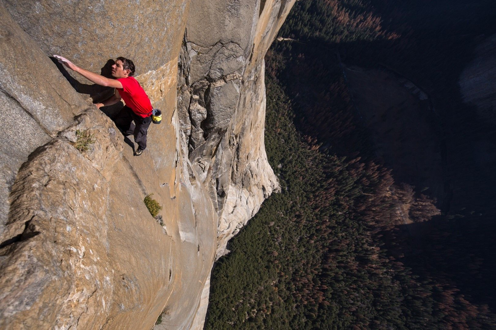
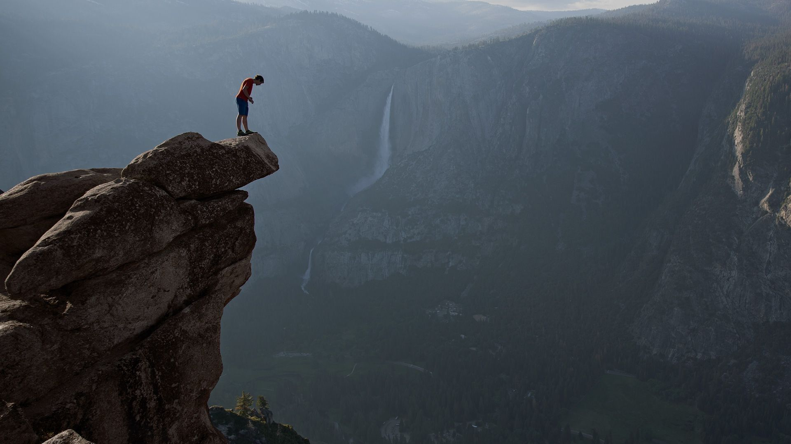

[facebook](https://www.facebook.com/sharer/sharer.php?u=https%3A%2F%2Fwww.natgeo.pt%2Fviagem-e-aventuras%2F2019%2F03%2Fentrevista-aos-dois-portugueses-premiados-em-free-solo) [twitter](https://twitter.com/share?url=https%3A%2F%2Fwww.natgeo.pt%2Fviagem-e-aventuras%2F2019%2F03%2Fentrevista-aos-dois-portugueses-premiados-em-free-solo&via=natgeo&text=Entrevista%20aos%20Dois%20Portugueses%20Premiados%20em%20Free%20Solo) [whatsapp](https://web.whatsapp.com/send?text=https%3A%2F%2Fwww.natgeo.pt%2Fviagem-e-aventuras%2F2019%2F03%2Fentrevista-aos-dois-portugueses-premiados-em-free-solo) [flipboard](https://share.flipboard.com/bookmarklet/popout?v=2&title=Entrevista%20aos%20Dois%20Portugueses%20Premiados%20em%20Free%20Solo&url=https%3A%2F%2Fwww.natgeo.pt%2Fviagem-e-aventuras%2F2019%2F03%2Fentrevista-aos-dois-portugueses-premiados-em-free-solo) [mail](mailto:?subject=NatGeo&body=https%3A%2F%2Fwww.natgeo.pt%2Fviagem-e-aventuras%2F2019%2F03%2Fentrevista-aos-dois-portugueses-premiados-em-free-solo%20-%20Entrevista%20aos%20Dois%20Portugueses%20Premiados%20em%20Free%20Solo) [A disseminação global do coronavírus está a afetar os viajantes. Mantenha-se atualizado sobre a explicação científica por trás do surto >>](https://www.natgeo.pt/coronavirus) 

[Viagem e Aventuras](https://www.natgeo.pt/viagem-e-aventuras) 
# Entrevista aos Dois Portugueses Premiados em Free Solo 
## Free Solo, recentemente vencedor do Óscar de Melhor Documentário, conta com dois portugueses na ficha técnica, distinguidos pelo seu trabalho de sonoplastia. Por [National Geographic](https://www.natgeo.pt/autor/national-geographic) Publicado 14/03/2019, 15:10 

Free Solo é um dos mais aclamados documentários de sempre da National Geographic Fotografia por © National Geographic [Free Solo](https://www.natgeo.pt/video/tv/free-solo) , vencedor do Óscar de Melhor Documentário, conta com dois nomes portugueses na sua ficha técnica: **Joana Niza Braga** e **Nuno Bento** , da equipa de sonoplastia. 

Joana Niza Braga e Nuno Bento são respetivamente _foley mixer_ e _foley artist_ do documentário da National Geographic, no qual os realizadores Elizabeth Chai Vasarhelvi e Jimmy Chin acompanham a escalada sem cordas ou proteções de Alex Honnold na parede de granito El Capitan. Conheça melhor o trabalho dos **dois portugueses distinguidos pelos Cinema Audio Society Awards e Golden Reel Awards** , feito numa pós-produtora de cinema em Lisboa. 

**Quão difícil foi reproduzir os sons e ruídos de Free Solo remotamente? 

JNB -** Diria que um dos maiores desafios de trabalhar remotamente é ter um certo _delay_ na comunicação e conseguir, no tempo que temos disponível, alcançar a visão pretendida. Geralmente quando são projetos internos, é-nos mais fácil perceber o que falta e o que não falta, pois conversamos com os cineastas, editores de imagem e som, e _mixers_ em pessoa e discutimos o projeto, se necessário. Trabalhando remotamente acabamos por, como disse anteriormente, ter este _delay_ de envio, espera, receção, feedback. 

**NB -** Hoje em dia fazer este tipo de trabalho remotamente não apresenta qualquer dificuldade acrescida exceto talvez as diferenças de fusos horários, caso seja necessário tirar alguma dúvida, ou seja, preciso repetir algum take, a presença física no estúdio do _foley_ _supervisor_ Roland Vajs também facilita o contacto entre nós e os editores. Para podermos começar as gravações precisamos da imagem e de qualquer nota relevante que possa existir sobre algum som em particular que a equipa precisa, de resto basta-nos ver o filme para percebermos o que falta e o que podemos adicionar. 

**Qual foi a cena mais difícil de trabalhar neste documentário? 

JNB -** Creio que neste projeto não existiu uma cena que fosse a mais difícil, mas sim o som recorrente mais indispensável e importante que tínhamos que procurar obter. Aqui refiro-me ao conjunto dos sons que juntos fazem a escalada de Alex. Sabíamos que este era o principal objetivo do nosso trabalho, visto que a montanha se comporta como uma personagem que acaba por responder aos movimentos de Alex. Tínhamos que conseguir recriar este conjunto de detalhes que estavam em falta e que ajudariam o espectador a transportar-se para a dimensão fílmica que temos presente. 

**NB -** No caso do Free Solo cada cena de escalada apresentava o desafio de trazer o som das mãos, corpo, pés e equipamento de uma forma coerente, credível e (híper)realista. O som das mãos em particular foi o mais difícil acho eu, não o ato em si, mas a questão de trazer detalhe de um gesto que na realidade não produz muito som, acabei por usar luvas de cabedal para poder usar a fricção do material na pedra suja com areia e terra de forma a ter mais controlo, detalhe e volume. Os sapatos do Alex também foram um objeto que precisou de especial atenção porque são feitos com uma sola que embora rija é também moldável. 

**Qual é o papel de um _foley mixer_ ? 

JNB -** _Foley_ pode ser considerado a gravação de efeitos sonoros em estúdio, posterior à rodagem. É no estúdio que se encontram o _foley artist_ e _foley mixer_ . O estúdio está separado pela régie, onde se encontra o _foley mixer_ , e a _recording room_ , onde se encontra o _foley artist_ . 

Durante uma sessão de gravação de _foley_ , o _mixer_ tem à sua frente uma mesa de mistura com controlo dos microfones dispostos na _recording room_ e terá que misturar o som que vem de cada um dos microfones num só, de modo a que o som gravado se encaixe com a acústica do som direto e/ou pretendido. 

Cabe também ao foley mixer guiar o foley artist durante a sessão. Por exemplo, numa cena com pessoas a andar, é o foley mixer quem diz ao foley artist que ele irá, no momento, fazer os passos da personagem X, com os sapatos Y, num determinado tipo de chão (cimento, madeira, linóleo, etc.) e qual o tipo de performance necessária. 

Fotografia por National Geographic **Qual é o papel de um _foley artist_ ? 

NB -** O papel de um _foley artist_ é recriar, numa espécie de performance, o som das ações presentes na imagem. Isto quer dizer que o objetivo é conseguir imitar os movimentos e interações dos atores no espaço de forma síncrona com a imagem, de forma a trazer com maior detalhe o som de todos os objetos presentes em cena. 

_Foley_ acaba por ser usado para cobrir dois aspetos necessários para a finalização de um filme, o primeiro objetivo é cobrir todo o som de materiais e movimentos que não foram captados ou que têm pouco detalhe. O segundo é cobrir o que é chamado de M&E ou _music & effects_ , essencialmente é a mistura de som completa do filme, mas sem diálogos usada principalmente para dobragens, é o material que é enviado para todos os países que vão fazer uma versão dobrada do filme. 

**Que som vos deu mais gozo reproduzir? 

JNB –** Como disse acima, neste projeto, foi concretizar o som da Montanha - isto é, os toques de Alex na montanha. 

**NB -** Esta pergunta é sempre complicada de responder, o meu trabalho exige que eu invente soluções para sons que são aborrecidos ou desprovidos de detalhes interessantes, estas soluções passam por arranjar objetos diferentes para um objeto em cena e por isso existem uma série de sons que dão imenso gozo reproduzir por motivos muito diferentes. A corda de segurança por exemplo, fiz com uma faca e um sofá de tecido, o molde de plástico que o Alex tem na perna fiz com uma máquina expresso de plástico, folhas feitas com a banda magnética de cassetes VHS… é raro o som que não me dá gozo reproduzir! 

**O que é que vos inspirou para trabalharem neste projeto? 

JNB -** Sempre gostei bastante de trabalhar em cinema documental e a verdade é que muitas vezes não existe uma procura pelo trabalho de _foley_ para este tipo de projetos. O trabalho deste filme prova que o trabalho de som no cinema documental é tão válido como no cinema de ficção, e que não deve ser descurado. 

**NB -** Inspiração para este tipo de trabalho vem de todos os sons do quotidiano, cada objeto que produz um som particular ou peculiar é sempre extremamente valioso e torna-se um hábito ouvir tudo o que acontece à nossa volta de uma forma extremamente consciente, acabo por ter uma espécie de base de dados na minha cabeça de todos os sons que podem servir para as mais variadas coisas. 

**Como é ser distinguida pelos Cinema Audio Society Awards, aos 27 anos? 

JNB -** Surreal!!! Completamente inesperado!!! Não estava de todo à espera da nomeação, quanto mais vencer a categoria com a equipa de mistura do filme, que por sim só já é uma equipa de sonho. Não há nada mais gratificante do que ter o reconhecimento dos nossos colegas. 

**Como é ser distinguido pelos Golden Reel Awards, aos 27 anos? 

NB -** Sinceramente fui apanhado de surpresa, quando soube que a equipa do Free Solo estava nomeada quis também saber quem eram as outras equipas de outros projetos que estavam nomeadas para a mesma categoria e assim que vi o _‘They Shall Not Grow Old’_ do Peter Jackson, tinha a certeza que todos os prémios de som iam imediatamente para esse documentário. Só estava meio errado, a equipa do Free Solo ficou empatada com a equipa do ‘ _They Shall Not Grow Old’_ e fiquei absolutamente incrédulo. 

_Esta entrevista foi encurtada por motivos de extensão e clareza._ 

**Veja o trailer de Free Solo:** 

<code>{"tag":"VIDEO"}</code> <code>{"tag":"VIDEO"}</code>  

Publicidade: O seu vídeo começa em 

--:-- 

-------- 
--:-- / --:-- 
-------- 

audio/video source is invalid 

This is a sample 

## Color 

## Opacity 

## Font 

## Size 

## Color 

## Effect 

## Color 

## Opacity 

Player Shortcuts 

Play/Pause 

P or Spacebar 

Full Screen 

F 

Exit Full Screen 

F or Esc 

Skip Back 5 Seconds 

← 

Skip Ahead 5 Seconds 

→ 

Jump Back 10 Seconds 

J 

Jump Ahead 10 Seconds 

L 

Restart 

0 or Home 

Skip to the End 

End 

Volume Up 

↑ 

Volume Down 

↓ 

Mute Audio 

M 

Toggle Closed Captions 

C 

Decrease Caption Size 

− 

Increase Caption Size 

= or + 

Cycle Caption Text Preset 

B 

Show Keyboard Controls 

<kbd>?</kbd> or / 

ACABOU DE VER 

#### Free Solo - Vencedor do Óscar de Melhor Documentário 

A SEGUIR 

Este vídeo começará em 

8 
segundos 

Free Solo - Vencedor do Óscar de Melhor Documentário 

