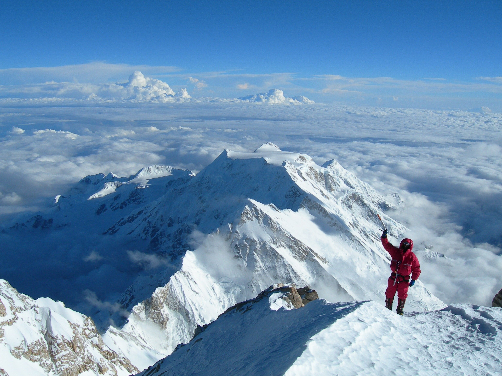
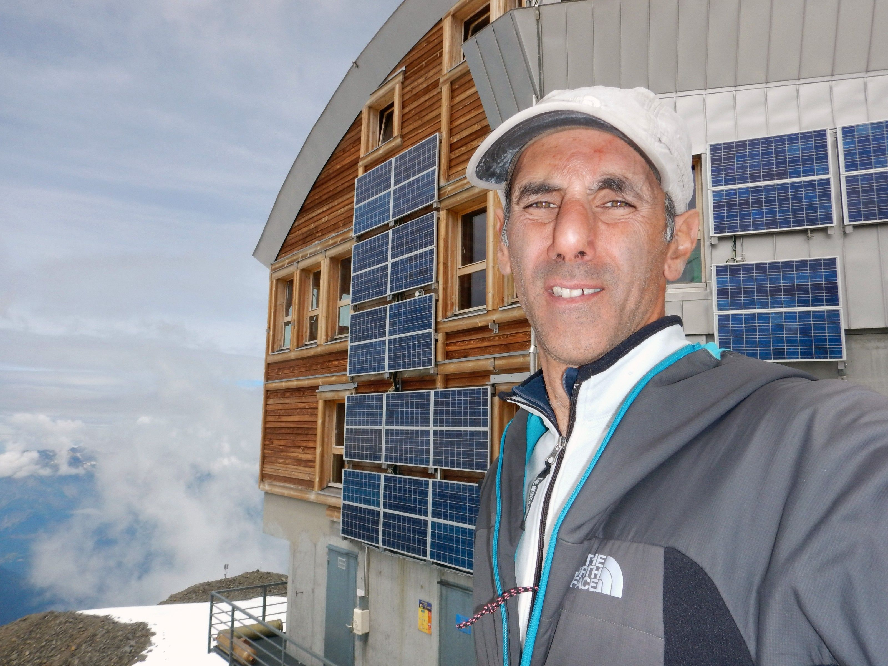

[facebook](https://www.facebook.com/sharer/sharer.php?u=https%3A%2F%2Fwww.natgeo.pt%2Fviagem-e-aventuras%2F2019%2F08%2Fentrevista-joao-garcia-20-anos-apos-o-evereste) [twitter](https://twitter.com/share?url=https%3A%2F%2Fwww.natgeo.pt%2Fviagem-e-aventuras%2F2019%2F08%2Fentrevista-joao-garcia-20-anos-apos-o-evereste&via=natgeo&text=Entrevista%20a%20Jo%C3%A3o%20Garcia%2C%2020%20Anos%20Ap%C3%B3s%20o%20Evereste) [whatsapp](https://web.whatsapp.com/send?text=https%3A%2F%2Fwww.natgeo.pt%2Fviagem-e-aventuras%2F2019%2F08%2Fentrevista-joao-garcia-20-anos-apos-o-evereste) [flipboard](https://share.flipboard.com/bookmarklet/popout?v=2&title=Entrevista%20a%20Jo%C3%A3o%20Garcia%2C%2020%20Anos%20Ap%C3%B3s%20o%20Evereste&url=https%3A%2F%2Fwww.natgeo.pt%2Fviagem-e-aventuras%2F2019%2F08%2Fentrevista-joao-garcia-20-anos-apos-o-evereste) [mail](mailto:?subject=NatGeo&body=https%3A%2F%2Fwww.natgeo.pt%2Fviagem-e-aventuras%2F2019%2F08%2Fentrevista-joao-garcia-20-anos-apos-o-evereste%20-%20Entrevista%20a%20Jo%C3%A3o%20Garcia%2C%2020%20Anos%20Ap%C3%B3s%20o%20Evereste) [A disseminação global do coronavírus está a afetar os viajantes. Mantenha-se atualizado sobre a explicação científica por trás do surto >>](https://www.natgeo.pt/coronavirus) 

[Viagem e Aventuras](https://www.natgeo.pt/viagem-e-aventuras) 
# Entrevista a João Garcia, 20 Anos Após o Evereste 
## Apaixonado por alpinismo desde os 16 anos e praticante de escalada sem recurso a oxigénio artificial, foi o primeiro português a escalar o Monte Evereste e continua com o objetivo de ir mais além. Por [National Geographic](https://www.natgeo.pt/autor/national-geographic) Publicado 22/08/2019, 11:00 

No ano em que se assinalam os 20 anos da sua escalada ao Monte Evereste, entrevistámos o alpinista português. Fotografia por Ivan Valejo Iniciou a sua dedicação à escalada na Serra da Estrela em 1983. Em 1990 integra uma comissão de serviço no Quartel Supremo das Forças Aliadas na Bélgica e intensifica a sua atividade nos Alpes. Em 1999 tornou-se no primeiro alpinista português a escalar o ‘topo do mundo’ – o Monte Evereste, na qual perdeu um companheiro de escalada e lhe deixou marcas físicas. 

Em 2010, João Garcia tornou-se o 10º alpinista no mundo a conseguir a proeza de escalar todas as 14 montanhas com mais de 8 mil metros sem recorrer a auxílio de oxigénio artificial nem carregadores de altitude. Ainda nesse ano, subiu ao cume do Monte Kosciuszko, alcançando o seu objetivo de escalar o cume mais alto de todos os continentes. 

Após escalar o Evereste, Aconcágua, Monte McKinley, Elbrus, Maciço Vinson, Kilimanjaro e Kosciuszko, João Garcia promete continuar a ir mais além. 

**Tem alguma memória de infância preferida?** 

Folhear revistas da National Geographic do meu pai em busca de reportagens com montanhas nevadas. 

**O que o inspira?** 

Tentar superar-me a mim próprio. 

**Que preocupações leva na mochila?** 

Segurança de quem vai comigo. 

**O que o faz ‘sonhar acordado’?** 

Projectos de novas escaladas ou alpinismo de exploração. 

**Se pudesse pedir um desejo para o Planeta, qual seria?** 

Mais árvores e menos plástico. 

João Garcia nos Alpes franceses. Fotografia por Tete Rousse **CURIOSIDADES 

Cresceu em…** Lisboa 

**O seu herói é…** RM, primeiro alpinista a subir Evereste sem recurso a O2 suplementar 

**Num dia típico…** treino e divirto-me 

**Para se divertir…** continuo a fazer o que gosto 

**O seu sítio preferido no mundo é…** algures no Nepal 

**Não consegue viajar sem…** mochila 

**O seu melhor conselho é…** “o sonho comanda a vida”. 

[source](https://www.natgeo.pt/viagem-e-aventuras/2019/08/entrevista-joao-garcia-20-anos-apos-o-evereste)