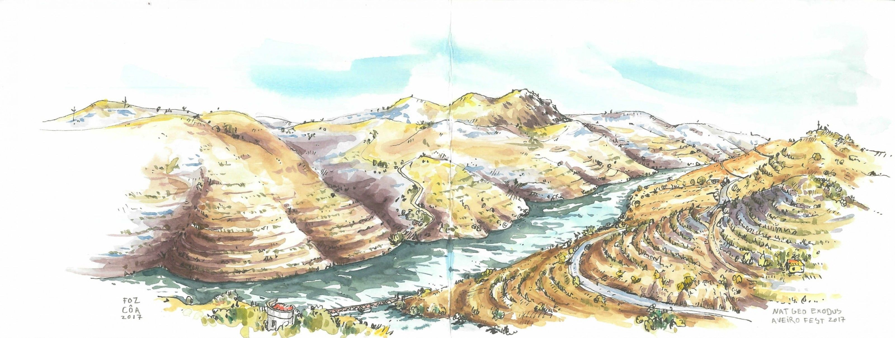
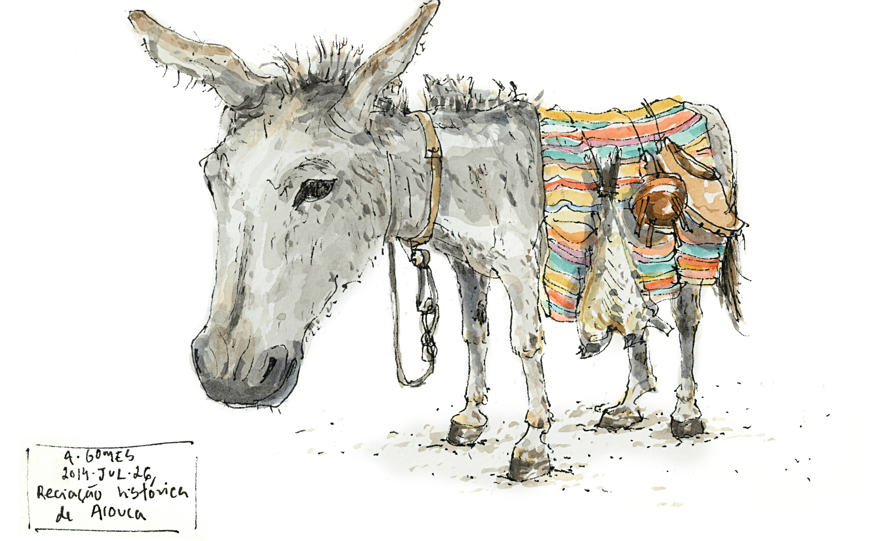

[facebook](https://www.facebook.com/sharer/sharer.php?u=https%3A%2F%2Fwww.natgeo.pt%2Fviagem-e-aventuras%2F2019%2F08%2Fsketching-por-caminhos-portugueses) [twitter](https://twitter.com/share?url=https%3A%2F%2Fwww.natgeo.pt%2Fviagem-e-aventuras%2F2019%2F08%2Fsketching-por-caminhos-portugueses&via=natgeo&text=Sketching%20por%20Caminhos%20Portugueses) [whatsapp](https://web.whatsapp.com/send?text=https%3A%2F%2Fwww.natgeo.pt%2Fviagem-e-aventuras%2F2019%2F08%2Fsketching-por-caminhos-portugueses) [flipboard](https://share.flipboard.com/bookmarklet/popout?v=2&title=Sketching%20por%20Caminhos%20Portugueses&url=https%3A%2F%2Fwww.natgeo.pt%2Fviagem-e-aventuras%2F2019%2F08%2Fsketching-por-caminhos-portugueses) [mail](mailto:?subject=NatGeo&body=https%3A%2F%2Fwww.natgeo.pt%2Fviagem-e-aventuras%2F2019%2F08%2Fsketching-por-caminhos-portugueses%20-%20Sketching%20por%20Caminhos%20Portugueses) [A disseminação global do coronavírus está a afetar os viajantes. Mantenha-se atualizado sobre a explicação científica por trás do surto >>](https://www.natgeo.pt/coronavirus) 

[Viagem e Aventuras](https://www.natgeo.pt/viagem-e-aventuras) 
# Sketching por Caminhos Portugueses 
## O sketcher André Gomes percorreu algumas estradas portuguesas e eternizou esses momentos em cadernos de viagens. Por [National Geographic](https://www.natgeo.pt/autor/national-geographic) Publicado 16/08/2019, 11:44 

Vista de Foz Côa, no distrito da Guarda. Fotografia por André Gomes Um sketch, um esboço, uma tentativa de imortalizar a realidade através de aguarelas. Os cadernos de viagem de **André Gomes** eternizam as suas aventuras por terras portuguesas. Buçaco, Ílhavo, Sortelha e Almeida foram alguns dos sítios por onde passou e nesta galeria compilamos alguns dos desenhos que foi traçando. 

Para o sketcher, o desenho “apresenta-se como componente indissociável da viagem, (…) testemunhando o mundo real, por meio de caneta e aguarelas”. É assim que André guarda memórias visuais do seu quotidiano – pessoas, circunstâncias, paisagens urbanas e campestres, lugares religiosos, entre outros. 

Sketch tem origem na palavra grega _schedios_ e significa fazer rapidamente, neste caso um desenho fluído que não implicará um trabalho final. É utilizado como forma de arte ou para gravar uma ideia para utilização ou memória posterior. 

Viaje por **caminhos portugueses através destas pinturas** , por paisagens distintas, da Ilha do Pessegueiro até ao Palácio do Buçaco e vá mais além! 

ver galeria 