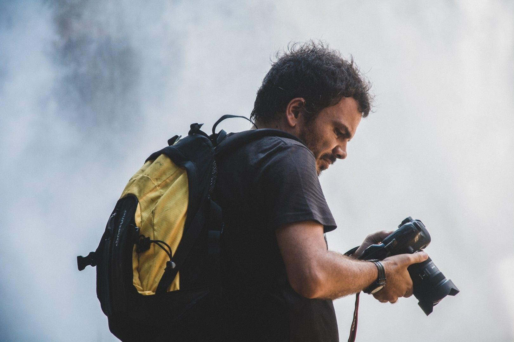

[facebook](https://www.facebook.com/sharer/sharer.php?u=https%3A%2F%2Fwww.natgeo.pt%2Fviagem-e-aventuras%2F2020%2F01%2Fentrevista-bernardo-conde-da-engenharia-lider-de-viagens) [twitter](https://twitter.com/share?url=https%3A%2F%2Fwww.natgeo.pt%2Fviagem-e-aventuras%2F2020%2F01%2Fentrevista-bernardo-conde-da-engenharia-lider-de-viagens&via=natgeo&text=Entrevista%20a%20Bernardo%20Conde%2C%20da%20Engenharia%20a%20L%C3%ADder%20de%20Viagens) [whatsapp](https://web.whatsapp.com/send?text=https%3A%2F%2Fwww.natgeo.pt%2Fviagem-e-aventuras%2F2020%2F01%2Fentrevista-bernardo-conde-da-engenharia-lider-de-viagens) [flipboard](https://share.flipboard.com/bookmarklet/popout?v=2&title=Entrevista%20a%20Bernardo%20Conde%2C%20da%20Engenharia%20a%20L%C3%ADder%20de%20Viagens&url=https%3A%2F%2Fwww.natgeo.pt%2Fviagem-e-aventuras%2F2020%2F01%2Fentrevista-bernardo-conde-da-engenharia-lider-de-viagens) [mail](mailto:?subject=NatGeo&body=https%3A%2F%2Fwww.natgeo.pt%2Fviagem-e-aventuras%2F2020%2F01%2Fentrevista-bernardo-conde-da-engenharia-lider-de-viagens%20-%20Entrevista%20a%20Bernardo%20Conde%2C%20da%20Engenharia%20a%20L%C3%ADder%20de%20Viagens) [A disseminação global do coronavírus está a afetar os viajantes. Mantenha-se atualizado sobre a explicação científica por trás do surto >>](https://www.natgeo.pt/coronavirus) 

[Viagem e Aventuras](https://www.natgeo.pt/viagem-e-aventuras) 
# Entrevista a Bernardo Conde, da Engenharia a Líder de Viagens 
## Entrevistámos Bernardo Conde, o fotógrafo, líder de viagem e fundador do Exodus Aveiro Fest, com quem conversámos sobre a sede de viajar e o estado de pertença ao nosso planeta. Por [National Geographic](https://www.natgeo.pt/autor/national-geographic) Publicado 13/01/2020, 14:27 , Atualizado 7/12/2020, 13:46 

Bernardo Conde viaja regularmente à Islândia, Madagáscar e Mongólia com grupos. 

Fotografia por Iolanda Silva Vive inquieto e não saberia viver de outra forma. Partilha a sua sede de viajar com grupos com quem viaja regularmente à Islândia, Madagáscar e Mongólia, enquanto líder de viagens. Há 12 anos criou o centro de fotografia documental [Trilhos da Terra](https://www.trilhosdaterra.com/) , em Aveiro, onde tem uma vasta oferta de workshops e atividades exploratórias. Tem várias exposições no seu portfólio e um livro editado - “Uma Janela para Marrocos”. É o fundador e organizador do [Exodus Aveiro Fest](https://www.natgeo.pt/exodus) e nada lhe dá mais prazer que mostrar o mundo aos outros. 

[**Bernardo Conde**](https://www.bernardoconde.com/) cresceu apaixonado pelo planeta e desde cedo se perdeu de amores por observar o meio natural. Agora, com 43 anos, continua dedicado à fotografia, às pessoas e à exploração do Mundo. 

**Explique o seu trabalho numa frase.** 

Qual deles? O elo de ligação de todas as minhas atividades profissionais é a fotografia e a viagem. Tento fazer que a fotografia possa ser um meio de comunicação, vivência de valores e uma escola de vida de momentos e de experiências, assim como, tento como tour leader mostrar a Mongólia, Madagáscar e a Islândia de uma forma intensa, embrenhada na realidade local de cada país, para que as vivências sejam mais especiais e genuínas. 

**Tem alguma memória de infância preferida?** 

Andar na natureza com os meus vizinhos embrenhado na natureza, com casas no meio dos arbustos, pescar na ria, ou ainda uma roadtrip pela costa portuguesa de Aveiro a Armação de Pêra parando em todas as praias, cabos e faróis. 

**O que abdicou para se dedicar às suas paixões?** 

Deixei a estabilidade de um trabalho certo e seguro como Engenheiro do Ambiente, para arriscar num mundo de incertezas de freelancer enquanto fotógrafo, tour leader e elemento da organização do Exodus Aveiro Fest. Abdiquei de estar com as minhas pessoas próximas para poder dar de mim ao mostrar o mundo a outras pessoas. 

**É a pé que gosta de viajar, fotografar e contactar com pessoas. O que o move?** 

Aprendi com o tempo que o que me dá mais prazer nas viagens são aqueles momentos fugazes que interajo com estranhos, entre apresentações, troca de palavras e retratos tirados, por vezes arranjo novos amigos. Com a repetição das viagens que faço profissionalmente estreito laços, e aquelas passam a ser as minhas pessoas. Por outro lado, o que me faz ir a um sítio fora as pessoas, é o encanto das montanhas, das florestas, e daquelas paisagens vastas que nos fazem lembrar que somos tão pequenos neste planeta especial com tanta coisa imensamente bonita para ver e vivenciar. 

**Qual a sua fotografia preferida neste momento?** 

O retrato da Batolum, a minha sobrinha ‘emprestada’ mongol, no meio de uma tempestade de neve enquanto o irmão a preparava para a levar para casa. 

Batolum, a sua sobrinha ‘emprestada’. Fotografia por Bernardo Conde **Quantas viagens faz por ano (internacionais e nacionais)? Como se encontra um sentido de pertença com tanto tempo fora por ano?** 

Diria que umas sete ou oito internacionais e nacionais umas três, estas últimas não são muito programadas, às vezes proporcionam-se. Ao todo ultimamente estou cerca de cinco a seis meses por ano fora. 

É uma boa questão, às vezes sinto que já não sou de lado nenhum, e que tenho várias casas. Sinto-me muito bem em cada um dos três países que frequento mais: em Madagáscar, Mongólia e Islândia, tenho pessoas que são referências locais para mim e isso faz-me sentir sempre bem naqueles locais, como se andasse a visitar tios e avós. Mas depois, no fundo no fundo, sabe-me sempre bem voltar ao paraíso que é a minha cidade Aveiro, aos meus projetos que fazem tanto parte de mim, e junto dos meus familiares e amigos, das pessoas que se gosta. Não sei se sentem isto quando voltam depois de uma viagem e chegam à vossa terra e à vossa casa, mas de alguma forma eu respiro de forma diferente. A adrenalina baixa, podemos abrandar e entrar noutro ritmo. 

**Devemos repensar o nosso sentido de pertença e presença no meio natural?** 

Acho que nos tempos que correm não nos podemos sentir donos do mundo, ou só ter olhos e preocupação para o que nos rodeia no nosso dia a dia. As nossas acções diárias somadas com as das outras pessoas acabam por ter grande impacto no meio natural que nos dá casa. 

**Que preocupações leva na mochila?** 

Desigualdades de oportunidades de acesso a alimento e educação, maus tratos a animais selvagens e destruição de natureza, incompreensão das diferentes culturas e maneiras dos povos estarem. Tudo isto fez-me tentar pôr no Exodus Aveiro Fest, maneira de informar as pessoas para que com informação correta possamos agir de forma mais inspirada, orientada e sustentada. 

**O que o faz ‘sonhar acordado’?** 

Paisagens de montanha, floresta, desertos, auroras boreais, vida selvagem, contacto com pessoas crescidas e crianças amistosas em locais remotos. 

**Se pudesse pedir um desejo para o Planeta, qual seria?** 

União nas vontades de toda a gente, sobretudo governativa, para fazermos melhor pelo planeta e pessoas. Utopicamente pedindo. 

**CURIOSIDADES 

Cresceu em…** Aveiro. 

**O seu herói é…** Jacques Cousteau (real), Indiana Jones (fictício). 

**Num dia típico…** de metade do ano viaja-se e fotografa-se, na outra metade ensina-se fotografia e organizam-se eventos. 

**Para se divertir…** toco guitarra e canto (ou algo semelhante). 

**O seu sítio preferido no mundo é…** um lugar perdido nas montanhas de Skaftafel na Islândia (até à data). 

**Não consegue viajar sem…** música. 

**O seu melhor conselho para um fotógrafo júnior é…** fotografar como se não houvesse amanhã, experimentar fotograficamente um pouco de tudo até encontrar o que lhe dá mais prazer em fotografar. 

**Acompanhe os seus projetos:** 

[Trilhos da Terra](https://www.trilhosdaterra.com/) 

[Conta de Instagram](https://www.instagram.com/bernardonconde/?hl=pt) 

[Exodus Aveiro Fest](https://www.exodusaveirofest.com/pt/evento/) 

