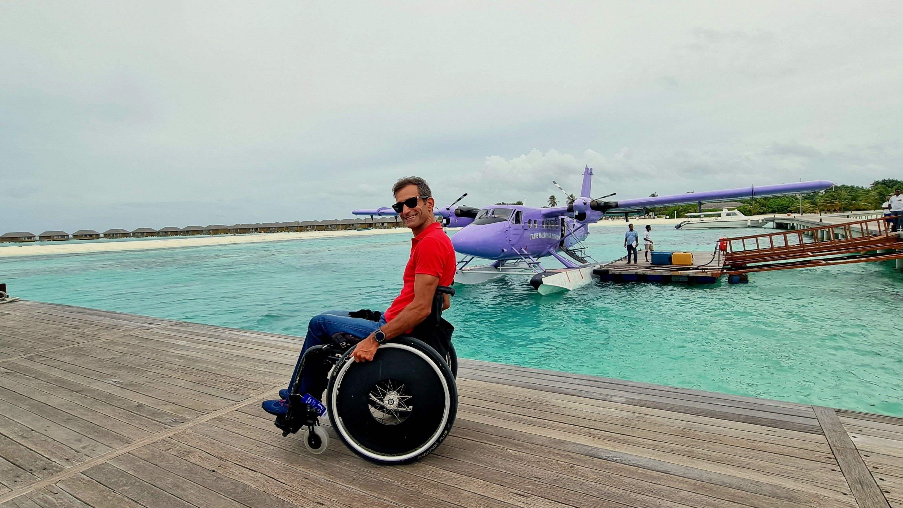

[facebook](https://www.facebook.com/sharer/sharer.php?u=https%3A%2F%2Fwww.natgeo.pt%2Fviagem-e-aventuras%2F2022%2F09%2Fentrevista-carlos-santos) [twitter](https://twitter.com/share?url=https%3A%2F%2Fwww.natgeo.pt%2Fviagem-e-aventuras%2F2022%2F09%2Fentrevista-carlos-santos&via=natgeo&text=Carlos%20Santos%3A%20%E2%80%9CUma%20vida%20sem%20desafios%20n%C3%A3o%20vale%20a%20pena%20ser%20vivida%E2%80%9D) [whatsapp](https://web.whatsapp.com/send?text=https%3A%2F%2Fwww.natgeo.pt%2Fviagem-e-aventuras%2F2022%2F09%2Fentrevista-carlos-santos) [flipboard](https://share.flipboard.com/bookmarklet/popout?v=2&title=Carlos%20Santos%3A%20%E2%80%9CUma%20vida%20sem%20desafios%20n%C3%A3o%20vale%20a%20pena%20ser%20vivida%E2%80%9D&url=https%3A%2F%2Fwww.natgeo.pt%2Fviagem-e-aventuras%2F2022%2F09%2Fentrevista-carlos-santos) [mail](mailto:?subject=NatGeo&body=https%3A%2F%2Fwww.natgeo.pt%2Fviagem-e-aventuras%2F2022%2F09%2Fentrevista-carlos-santos%20-%20Carlos%20Santos%3A%20%E2%80%9CUma%20vida%20sem%20desafios%20n%C3%A3o%20vale%20a%20pena%20ser%20vivida%E2%80%9D) [A disseminação global do coronavírus está a afetar os viajantes. Mantenha-se atualizado sobre a explicação científica por trás do surto >>](https://www.natgeo.pt/coronavirus) 

[Olhares de Portugal](https://www.natgeo.pt/olhares-de-portugal) 
# Carlos Santos: “Uma vida sem desafios não vale a pena ser vivida” 
## O aventureiro Carlos Santos encontrou nas viagens e no desporto um portal de liberdade, após um acidente traumático. Por [Filipa Coutinho](https://www.natgeo.pt/autor/filipa-coutinho) Publicado 21/09/2022, 08:55 

Fotografia por Carlos Santos Esta é uma história que se aproxima do impossível. Um caminho herculano. 

Encontrámo-nos na rampa de saída da Associação Naval de Lisboa, após um dos treinos de vela semanais de Carlos. O seu entusiasmo e alegria pelo desporto são imediatamente evidentes. Em 2001, a paixão por motas “lançou-o” para uma cadeira de rodas. Com apenas 23 anos, a vida que tinha pela frente esteve perto de não se desenrolar. Após nove meses de internamento, concluiu o curso de Economia e mais tarde uma pós-graduação em Banca, Seguros e Mercados Financeiros. 

Nos 21 anos que se seguiram, nem tudo tem sido fácil. “Nunca se está preparado para uma mudança tão drástica na nossa vida”, reflete. Carlos Santos teve um longo período de luto e luta, que durou mais do que gostaria, cerca de quatro anos. Agora, lamenta o tempo que levou a perceber que a condição de paraplégico não o iria impedir de fazer nada do que uma pessoa sem limitações físicas faz. 

### “Hoje arrependo-me do demasiado tempo que levei a perceber que era possível fazer tudo o que uma pessoa sem limitações faz, mas com a certeza de que estou a aproveitar a vida ao máximo desde então.” No desporto e nas viagens descobriu duas fontes de liberdade e paixão, às quais dedica todo o tempo livre. Competiu durante cinco anos na modalidade de andebol em cadeira de rodas e agora compete na vela e em _handbike_ . Afincado em provar que não existem limites, pratica também _rugby_ em cadeira de rodas, _surf_ , esqui, _paddle_ e não dispensa as idas ao ginásio. 

Nas viagens, planeadas sempre ao detalhe, a cadeira de rodas não pode ser um entrave. “A nossa limitação não pode, nem deve impedir-nos de concretizar esse gosto”. No entanto, não deixa de ser um desafio planear uma viagem, especialmente para destinos que não estão minimamente adaptados para pessoas com mobilidade reduzida. Para Carlos Santos, "uma vida sem desafios não vale a pena ser vivida”. 

Carlos Santos durante um dos mergulhos que fez em viagem. 

Fotografia por Carlos Santos **Qual o papel dos amigos e família na adversidade?** 

Na altura do meu acidente recusei sempre o apoio psicológico. Passei um mau bocado, como é normal para qualquer pessoa que passe por um acidente como o que tive. Os meus amigos foram fundamentais porque nunca desistiram de mim. Cheguei a deixar amigos à porta de casa porque quando tive alta do hospital passei uma fase de revolta, em que não queria ver ninguém. 

Um médico na altura disse-me “tu infelizmente estás numa situação em que vais ver quem são verdadeiramente os teus amigos”, e tive poucas ou quase nenhumas desilusões. O suporte familiar e dos meus amigos foi indispensável e essencial para ultrapassar essa fase menos boa. Tanto os amigos como a família têm-me acompanhado ao longo do meu percurso. São tão importantes que ainda hoje, independentemente das condições de acessibilidade, fazem questão de me levar a todo o lado. Sei que, quando saio ou viajo com eles, nunca fica nada por fazer. Não há barreiras que me impeçam de fazer alguma coisa quando estou com eles. 

**O que o inspira?** 

Um dos meus lemas de vida é “o que não nos mata, torna-nos mais fortes”. Desde então, agarrei-me à vida e tento aproveitá-la ao máximo. Neste momento, faço coisas que nunca pensei vir a fazer como no caso do desporto, onde pratico um pouco de tudo. 

Carlos Santos próximo de um elefante, na viagem à Tailândia. 

Fotografia por Carlos Santos **Como se escolhem destinos e planeiam viagens com uma cadeira de rodas?** 

É uma aventura! Não é fácil planear uma viagem e leva muitas horas. Eu e a minha companheira, com quem viajo sempre, despendemos muitas horas. Temos de ter a preocupação de escolher hotéis minimamente adaptados, saber se os museus e sítios que queremos visitar são acessíveis e, se não são, temos a preocupação de enviar emails ou ligar para saber as condições. 

Muitas vezes no site dos hotéis vemos a indicação de um hotel com condições para hóspedes de mobilidade reduzida, mas por experiência, nem sempre é assim. Para eles, ter condições para uma cadeira de rodas é chegar e não ter um degrau e esquecem-se de tudo o resto – o espaço, a largura das portas, a própria casa de banho do quarto. Por vezes deparo-me com um duche sem um banco para me sentar, em hotéis que dizem ser acessíveis. 

Quando fui à Tailândia, a meu pedido, enviaram-me fotografias e medidas das portas por email, para me certificar que a minha cadeira entrava. 

**Conhece alguma agência de viagens especializada?** 

Por norma, apesar de dar mais trabalho, planeamos as viagens sozinhos. Já fiz algumas viagens através de agências mas nunca com nenhuma especializada. 

Conheço, por exemplo, a [Tourism For All](https://www.tourism-for-all.com/en/home/) que consultei uma vez no passado, no entanto, os preços praticados são muito elevados comparativamente aos praticados por outras agências. Acredito que estas agências arranjem soluções adequadas à limitação da pessoa que os contacta, mas prefiro organizar as minhas viagens e assim, não só poupo bastante, como escolho os destinos e atividades sem grandes surpresas. Alguns destinos têm também ofertas para passeios acessíveis, lembro-me da [Reduced Mobility Tours BY Madeira Acessível By Wheelchair](https://madeiraacessivelbywheelchair.pt/en/?fbclid=IwAR3icNRDRU8zteAp_3sXAeMcj9glSOfZjq9I0Xs5H08dEmmxYIkQafE8Yb8) mas, estes serviços personalizados, acabam por encarecer a viagem. Felizmente, apesar da minha paraplegia, tenho bastante mobilidade, sou muito aventureiro e ainda não senti necessidade de recorrer a estes serviços. 

**Esquerda:** **Superior:** Carlos Santos numa cascata na ilha da Madeira. 

**Direita:** **Inferior:** Carlos Santos em Vitoria Gasteiz, no País Basco. 

fotografias de Carlos Santos **Alguma vez teve uma má experiência em viagem?** 

Por exemplo, numa viagem que fiz a Cabo Verde fui para um hotel na Boavista, onde me disseram que era acessível. Chego lá e deparo-me com um degrau de 50 centímetros no acesso ao chuveiro. Acabaram por me arranjar uma rampa de madeira improvisada para subir para a zona do chuveiro e uma cadeira de praia, que grande parte das vezes é o que me ‘desenrasca’. 

Em junho, quando fui competir nos campeonatos de vela, fiquei num hotel supostamente acessível. Esse quarto tinha barras na casa de banho, mas o chuveiro mais uma vez não tinha banco. Liguei para a receção e quando voltei ao quarto o banco que tinham trazido era um banco de acesso aos armários. 

**E nos aviões, como funciona?** 

É mais uma coisa que tem de se preparar com antecedência, e mesmo assim nem sempre corre bem. Por diversas vezes tive que estar muito tempo à espera do _ambulift_ [o veículo adaptado para saída da aeronave], dentro do avião. Já cheguei a estar mais de uma hora à espera, ainda que a tripulação saiba que viaja uma pessoa com mobilidade reduzida a bordo. Uma vez em Paris, estive tanto tempo à espera – e a tripulação não tem autorização para pegar em mim ao colo – que, já sem paciência para esperar mais, acabaram por ser aos meus amigos a tirar-me ao colo do avião. 

Em relação à minha cadeira de rodas, não deixam que a mesma viaje comigo na cabine, pelo que viajo sempre com a preocupação de saber se chegará intacta ao destino ou se eventualmente chegará, preocupação esta que aumenta quando as viagens incluem escalas. Felizmente até à data tive apenas um problema no regresso a Lisboa que ao invés de me entregarem a cadeira à porta do avião, conforme faço sempre questão de pedir, colocaram a cadeira nos tapetes e a cadeira ficou toda empenada. Agora imaginem isto acontecer num destino onde não me consigam arranjar uma cadeira de rodas de substituição e, mesmo que arranjem, dificilmente será adaptada a mim (não é por acaso que a cadeira é feita à minha medida e tendo em conta a minha mobilidade). 

**Tem heróis de viagem ou referências de vida?** 

Depois do meu acidente, conhecer pessoas com situações idênticas à minha, foi o que me inspirou. Nomeadamente, através da Associação Salvador. Esses são os meus heróis e são as pessoas que tenho como referência. Tenho aprendido muito com eles e muito do que faço hoje em dia é pelo seu exemplo. 

Carlos Santos na sua viagem recente às Maldivas, onde encontrou espaços facilmente adaptáveis a receber hóspedes com mobilidade reduzida. 

Fotografia por Carlos Santos **Se pudesse mudar algo no mundo das viagens, o que seria?** 

Felizmente já viajei bastante e espero viajar muito mais. O que mudaria era as pessoas e hotéis verem que é possível e tão fácil adaptar as coisas para uma pessoa como eu poder usufruir [desses espaços] como outra qualquer. Recentemente estive nas Maldivas e sabia que à partida seria um destino que não seria acessível. No entanto, era muito fácil adaptar o resort onde estive… coisas simples como ter uma cadeira de rodas anfíbia, substituir o único degrau de acesso ao restaurante e à receção por uma rampa, o acesso às piscinas tinha vários degraus, mas espaço suficiente para fazer uma rampa. É tão fácil tornar um espaço inacessível num sítio acessível… 

**Que destinos recomenda cá em Portugal e lá fora para alguém que use uma cadeira de rodas e queira viajar?** 

Lá fora, para os destinos a que tenho ido, é difícil aconselhar uma pessoa que vá sozinha numa cadeira de rodas. Um destino que posso recomendar no país vizinho, é Barcelona, um ótimo exemplo de acessibilidade. A cidade está toda adaptada para pessoas com mobilidade reduzida. 

O País Basco também tem vários exemplos de cidades com tudo acessível. Bilbao, é uma delas, onde muitas vezes tiro fotografias que servem de exemplo. Nos lugares de estacionamento há sinalética que diz “ _Si te quedas con mi plaza, quédate también con mi discapacidad_ ” ("se me tiras o lugar, fica também com a minha incapacidade”). Outro ótimo exemplo é Vitória Gasteiz, onde no acesso à zona histórica da cidade existem passadeiras rolantes, algumas cobertas para maior proteção no inverno. Há elevadores em pleno centro da cidade e o piso é incrível. Vou lá muitas vezes por ser uma cidade tão acessível. 

Cá em Portugal há ainda um longo caminho a fazer para receber pessoas que nos queiram visitar. Já estive na Madeira e em duas ilhas dos Açores, mas infelizmente é complicado. É possível, mas temos de ir predispostos a ultrapassar algumas barreiras com ajuda. Quando viajo cá dentro já sei que dificilmente não irei precisar da ajuda de alguém, nem que seja para subir um passeio. 

**E qual será a próxima aventura?** 

Em outubro vou para o México e no Natal vou para o País Basco. Para o ano estou a pensar fazer Singapura e Bali, mas ainda não está marcado. 

Pode acompanhar as aventuras de Carlos Santos na sua conta de [Instagram](http://www.instagram.com/duca.adventures) . 

