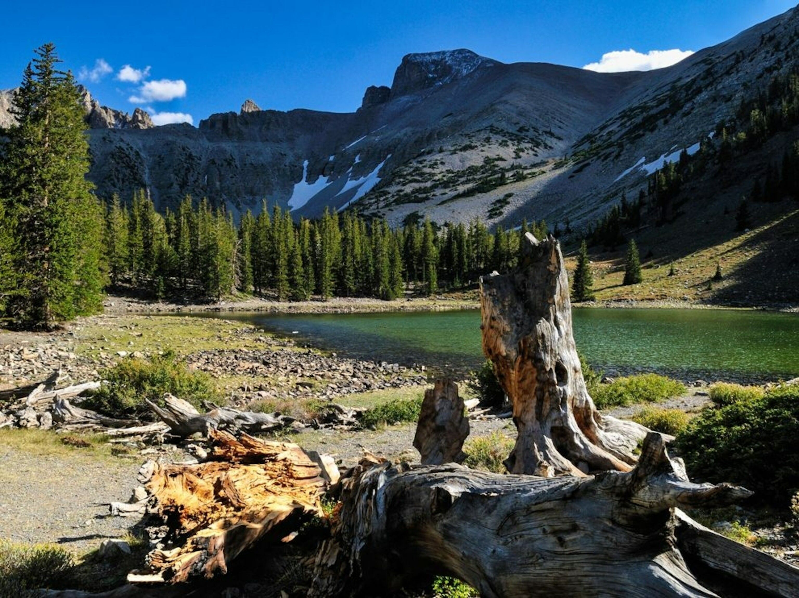
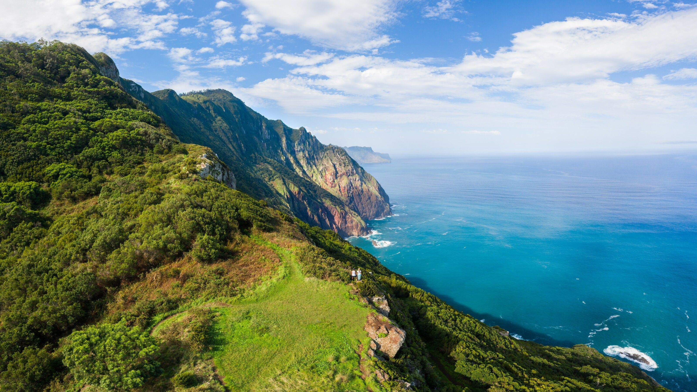
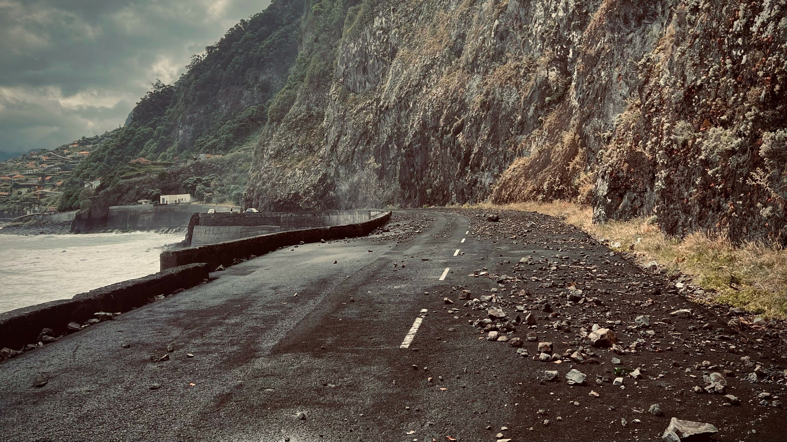
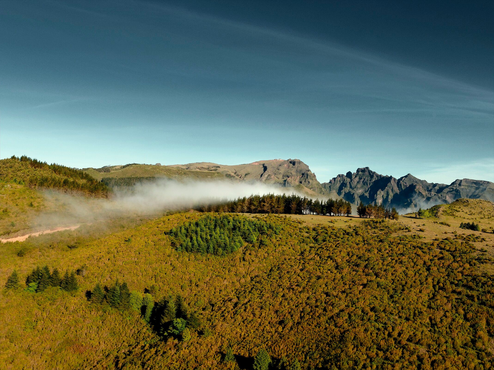
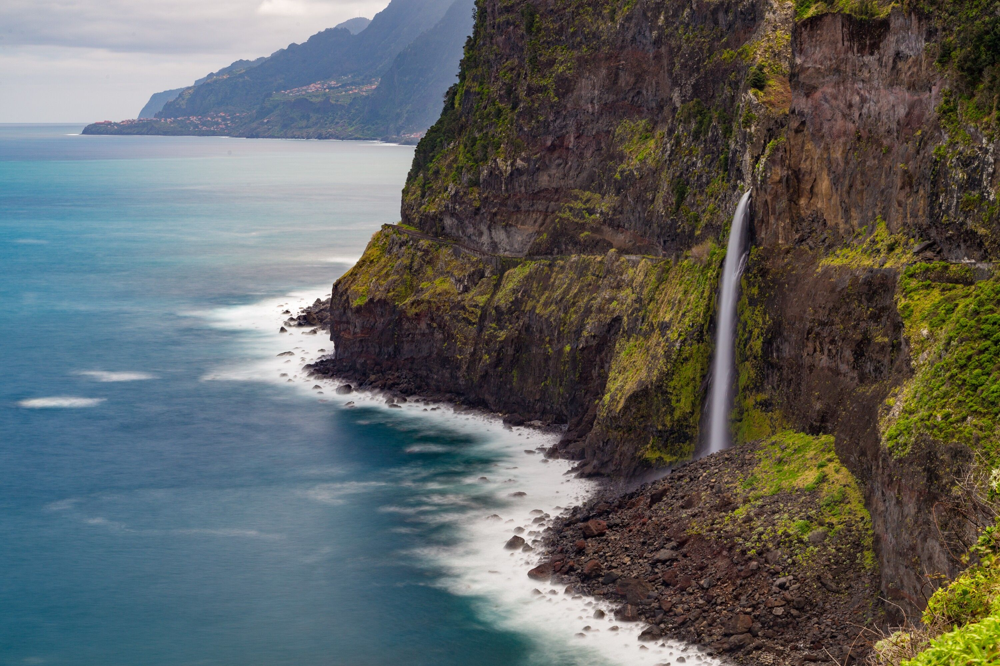

[facebook](https://www.facebook.com/sharer/sharer.php?u=https%3A%2F%2Fwww.natgeo.pt%2Fviagem-e-aventuras%2F2022%2F06%2Fsera-este-trilho-na-madeira-a-proxima-grande-rota-portuguesa) [twitter](https://twitter.com/share?url=https%3A%2F%2Fwww.natgeo.pt%2Fviagem-e-aventuras%2F2022%2F06%2Fsera-este-trilho-na-madeira-a-proxima-grande-rota-portuguesa&via=natgeo&text=Ser%C3%A1%20este%20trilho%20na%20Madeira%20a%20pr%C3%B3xima%20Grande%20Rota%20portuguesa%3F) [whatsapp](https://web.whatsapp.com/send?text=https%3A%2F%2Fwww.natgeo.pt%2Fviagem-e-aventuras%2F2022%2F06%2Fsera-este-trilho-na-madeira-a-proxima-grande-rota-portuguesa) [flipboard](https://share.flipboard.com/bookmarklet/popout?v=2&title=Ser%C3%A1%20este%20trilho%20na%20Madeira%20a%20pr%C3%B3xima%20Grande%20Rota%20portuguesa%3F&url=https%3A%2F%2Fwww.natgeo.pt%2Fviagem-e-aventuras%2F2022%2F06%2Fsera-este-trilho-na-madeira-a-proxima-grande-rota-portuguesa) [mail](mailto:?subject=NatGeo&body=https%3A%2F%2Fwww.natgeo.pt%2Fviagem-e-aventuras%2F2022%2F06%2Fsera-este-trilho-na-madeira-a-proxima-grande-rota-portuguesa%20-%20Ser%C3%A1%20este%20trilho%20na%20Madeira%20a%20pr%C3%B3xima%20Grande%20Rota%20portuguesa%3F) [A disseminação global do coronavírus está a afetar os viajantes. Mantenha-se atualizado sobre a explicação científica por trás do surto >>](https://www.natgeo.pt/coronavirus) 

[Viagem e Aventuras](https://www.natgeo.pt/viagem-e-aventuras) 
# Será este trilho na Madeira a próxima Grande Rota portuguesa? 
## O trilho de 200 quilómetros desbravado recentemente por André Rocha em cinco dias, reúne declives estonteantes e cenários soberbos, naquela que pode tornar-se uma das primeiras grandes rotas costeiras na ilha da Madeira. Por [Filipa Coutinho](https://www.natgeo.pt/autor/filipa-coutinho) Publicado 23/06/2022, 12:01 

André Rocha fez uma caminhada épica que contornou a Madeira, não escapando à morfologia vertiginosa da ilha. 

Fotografia por [André Rocha](https://www.natgeo.pt/fotografo/andre-rocha) **Luxo é caminhar a solo** num paraíso insular sem avistar gente por muitos quilómetros, apreciando o instante. Assim caminhou André Rocha durante cinco dias em meados de junho. A Grande Rota que mapeou por GPS e que entusiasticamente chamou “Grande Rota Índigo” poderá estar no horizonte do governo regional da Madeira para ser proposta e integrada no plano de rotas nacional. 

Após [percorrer a pé](https://www.natgeo.pt/viagem-e-aventuras/2021/12/andre-rocha-caminhada-costa-continental-portuguesa) a costa continental portuguesa no ano passado, o gestor e fundador do [The Escapist](https://www.instagram.com/theescapist______/) voltou a desafiar-se ao longo de 208 quilómetros, com desníveis impraticáveis para os viandantes de coordenadas mais planas. Esta foi uma verdadeira fruição da topografia madeirense, que André Rocha sentiu na pele. 

A aventura foi projetada há alguns meses e contou com o apoio de entidades regionais e do Instituto de Florestas e Conservação da Natureza. A partir desta matriz, André Rocha apresenta um novo percurso pedestre litoral que privilegia a exploração da ilha no seu contorno. 

Vereda do Larano, um dos lugares por onde André caminhou. 

Fotografia por DigitalTravelCouple 
## **A superação física para grandes aventureiros** 
É fácil imaginar uma fuga nesta ilha com paisagens pintadas por Winston Churchill, durante a sua estadia na ilha em 1950. O que não é fácil é fazer o percurso que André Rocha fez. Esta é uma rota particularmente desafiante em terreno acidentado, por vezes com vegetação alta, e um clima marítimo temperado que pode tornar-se demasiado ameno para o esforço físico. 

As subidas vertiginosas vão-se mesclando com descidas para praias banhadas pelo tom índigo com o qual André ‘batizou’ o nome da Grande Rota. Este sobe e desce constante foi um dos maiores desafios da rota. Os outros? “Vegetação densa, piso acidentado e ultra variado (alcatrão, terra, pedra, escarpa, pântano, floresta), vento, dias de caminhada longos (40 quilómetros por dia) e a tentação do mergulho em cada praia por onde se passa”. Felizmente, não se registaram incidentes graves, mas alguns desequilíbrios terminaram em quedas, na descida da floresta Laurissilva. 

Um dos receios de André eram as derrocadas na estrada marginal da costa norte. 

Fotografia por [André Rocha](https://www.natgeo.pt/fotografo/andre-rocha) Apesar de ainda não existir nenhuma grande rota oficial na ilha, na sua opinião “a Madeira tem a infraestrutura natural mais do que necessária para ser imbatível no delinear de uma grande rota”. Por onde começar? “Nós, os que podemos intervir, devemos democratizar a beleza e exuberância da ilha, dando narrativa e condições para uma travessia segura pelos recantos e aventuras de toda a ilha”. 

## **Porquê a ilha da Madeira?** 
André tem uma especial atração por rotas arrojadas e extensas. Em dezembro passado já tinha explicado que quando caminha “longos percursos, o processo físico e intelectual ganha um perfil diferente, sendo porventura a única situação em que o primeiro se impõe e prevalece face ao segundo”. Nessa [conversa](https://www.natgeo.pt/viagem-e-aventuras/2021/12/andre-rocha-caminhada-costa-continental-portuguesa) sugeriu sairmos do triângulo em que vivemos quotidianamente: casa – trabalho – comunidade. “Se nos aventurarmos a sair desse triângulo com tudo o que precisarmos ao ombros, a previsibilidade e a rotina são imediatamente substituídos pela surpresa e o assombro da descoberta, e sobretudo pela liberdade de uma boa aventura, onde comandamos os nossos destinos durante o tempo que entendermos". 

Na sua opinião a “exuberância da vegetação, a diversidade costeira (norte e sul são dois mundos diferentes) e o desnível fazem da Madeira um Disneyland para quem gosta de aventura e fusão com a natureza envolvente”. Confessa ainda que a “Madeira fica-nos na pele”. 

Na opinião de André, um dos lugares mais bonitos desta rota é Chão da Lagoa, na área do Parque Natural da Madeira. 

Fotografia por Secretaria Regional de Turismo e Cultura da Madeira 
## **Um janelão para a aventura aqui ao lado** 
A ilha da Madeira é globalmente conhecida pelo seu clima soalheiro, gastronomia de suspirar por mais e beleza tropical. Além de um vasto cardápio de [trilhos](https://www.visitmadeira.com/pt-pt/o-que-fazer/atividades/pesquisa/madeira/atividades/percursos-pedestres-recomendados) e atividades de aventura, é palco de muitos [eventos culturais](https://www.visitmadeira.com/pt-pt/o-que-fazer/eventos) . Fica a uns tentadores 90 minutos de voo a partir de Lisboa e a duas horas do Porto. 

A floresta Laurissilva, incluída na área do Parque Natural da Madeira, ocupa uma área com cerca de 15000 hectares, sendo uma das maiores do mundo. Esta relíquia do Terciário integra a lista dos Patrimónios Mundiais Naturais da UNESCO e abriga uma rede de percursos pedonais e veredas. 

Estrada antiga entre Seixal e S. Vicente na costa Norte da ilha da Madeira. 

Fotografia por José Mendes A biodiversidade da ilha merece ser celebrada com uma paragem nos Miradouros dos Balcões, do Cabo Aéreo e de Cabanas. Se a sua visita permitir um brinde, não perca a Rota dos Vinhos da Madeira. O Jardim Botânico da Madeira e os jardins do ilhéu de Câmara de Lobos são outras duas visitas que não desiludem. Leia mais [propostas](https://www.natgeo.pt/viagem-e-aventuras/2020/01/descubra-o-cobicado-vinho-que-colocou-a-ilha-da-madeira-no-mapa) sobre onde ficar e como se entreter. 

Questionei que outras aventuras André Rocha recomenda na ilha. “A travessia NORTE-SUL, o circuito do MIUT, a caminhada da ponta de são Lourenço e o parapente na Madalena do Mar”. Esta Grande Rota Índigo não será uma rota para todos. 

Arrisco dizer que é direcionada a aventureiros com A maiúsculo, como André. 

[source](https://www.natgeo.pt/viagem-e-aventuras/2022/06/sera-este-trilho-na-madeira-a-proxima-grande-rota-portuguesa)