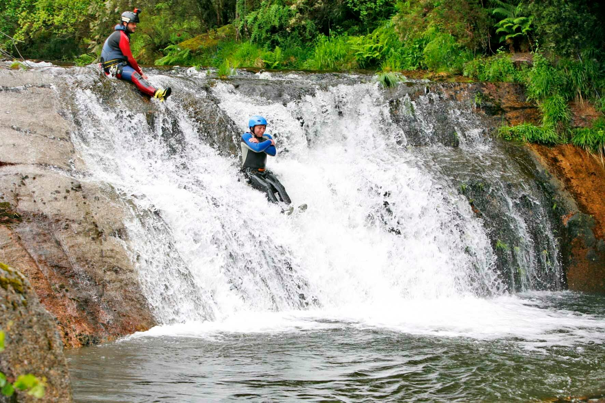
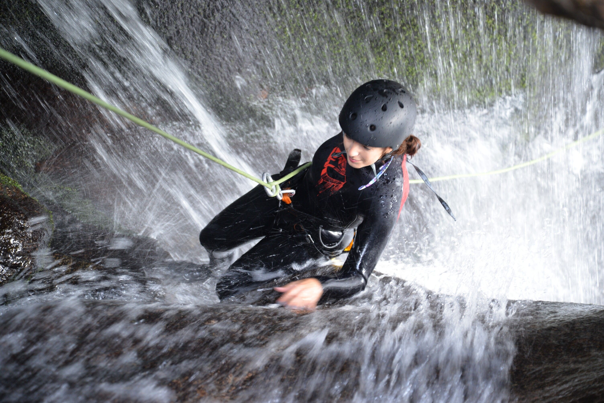
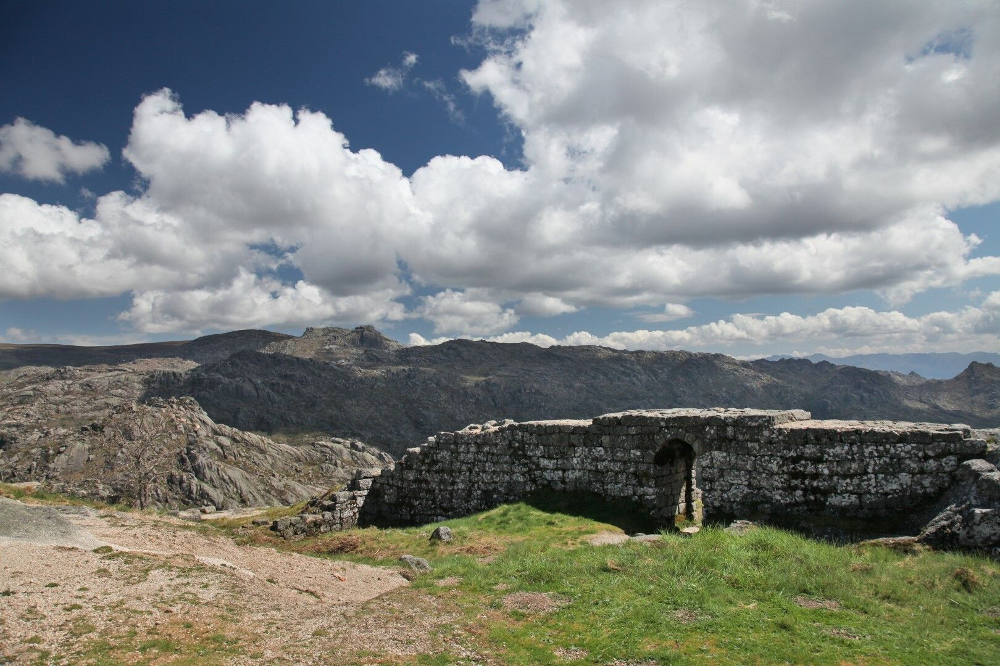
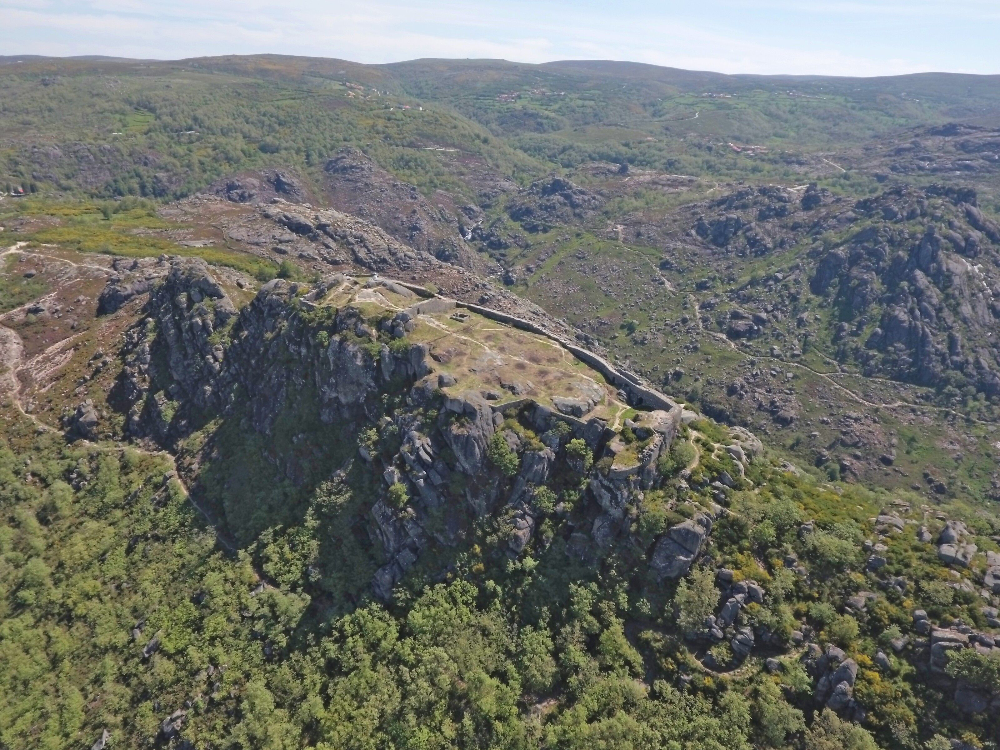
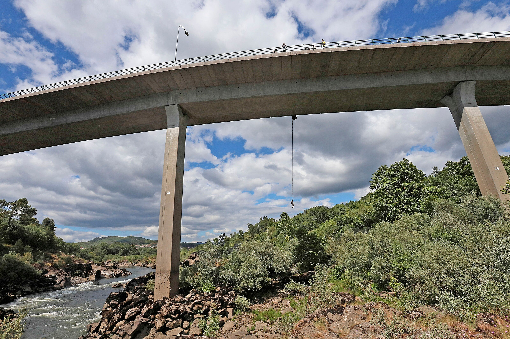
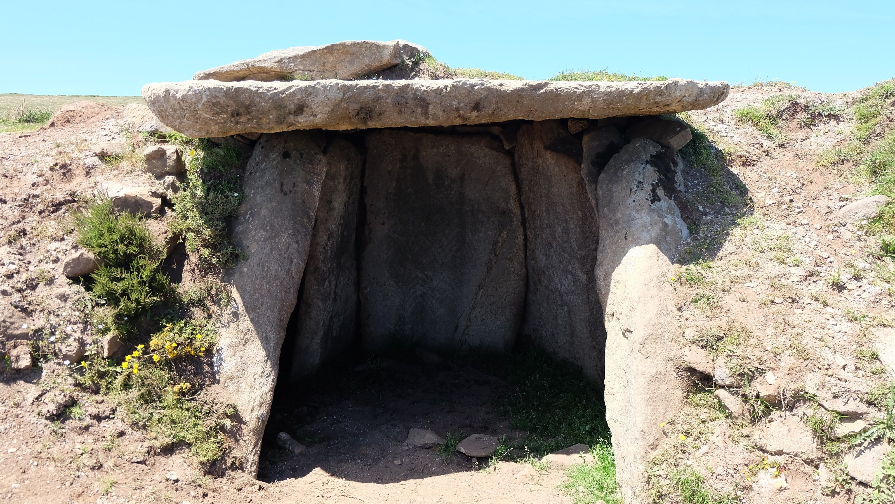
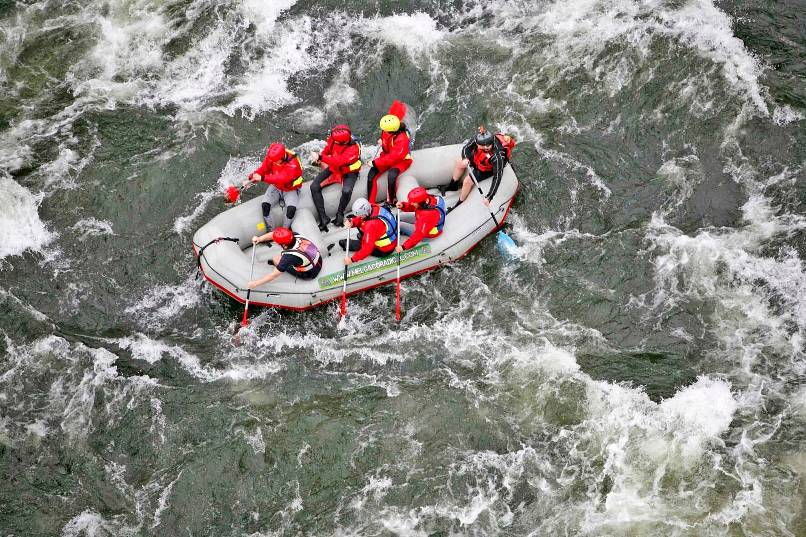
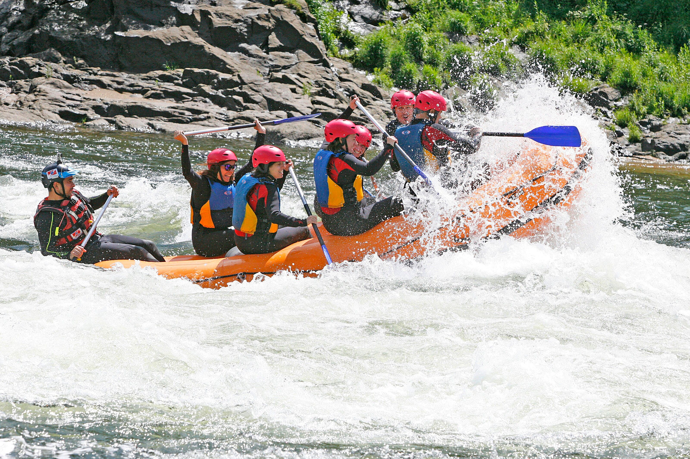

[facebook](https://www.facebook.com/sharer/sharer.php?u=https%3A%2F%2Fwww.natgeo.pt%2Fviagem-e-aventuras%2F2021%2F06%2F7-atividades-no-destino-de-natureza-mais-radical-de-portugal) [twitter](https://twitter.com/share?url=https%3A%2F%2Fwww.natgeo.pt%2Fviagem-e-aventuras%2F2021%2F06%2F7-atividades-no-destino-de-natureza-mais-radical-de-portugal&via=natgeo&text=7%20Atividades%20no%20destino%20de%20natureza%20mais%20radical%20de%20Portugal) [whatsapp](https://web.whatsapp.com/send?text=https%3A%2F%2Fwww.natgeo.pt%2Fviagem-e-aventuras%2F2021%2F06%2F7-atividades-no-destino-de-natureza-mais-radical-de-portugal) [flipboard](https://share.flipboard.com/bookmarklet/popout?v=2&title=7%20Atividades%20no%20destino%20de%20natureza%20mais%20radical%20de%20Portugal&url=https%3A%2F%2Fwww.natgeo.pt%2Fviagem-e-aventuras%2F2021%2F06%2F7-atividades-no-destino-de-natureza-mais-radical-de-portugal) [mail](mailto:?subject=NatGeo&body=https%3A%2F%2Fwww.natgeo.pt%2Fviagem-e-aventuras%2F2021%2F06%2F7-atividades-no-destino-de-natureza-mais-radical-de-portugal%20-%207%20Atividades%20no%20destino%20de%20natureza%20mais%20radical%20de%20Portugal) [A disseminação global do coronavírus está a afetar os viajantes. Mantenha-se atualizado sobre a explicação científica por trás do surto >>](https://www.natgeo.pt/coronavirus) 

[Viagem e Aventuras](https://www.natgeo.pt/viagem-e-aventuras) 
# 7 Atividades no destino de natureza mais radical de Portugal 
## Este município em Portugal tem-se afirmado como o destino de natureza mais radical do país e oferece aventuras para todas as idades. Por [Filipa Coutinho](https://www.natgeo.pt/autor/filipa-coutinho) Publicado 30/06/2021, 12:22 

Melgaço, sede do concelho mais a norte de Portugal, é abraçado por serras e serpenteado pelos rios Minho, Laboreiro, Mouro e Trancoso. 

Fotografia por Município de Melgaço **Quando chegamos a Melgaço,** deixamo-nos contagiar pelo entusiasmo com que nos recebem. A afetuosa simpatia e generosidade dos seus habitantes acompanha o mais simples contacto. 

Melgaço, uma região marcada pelos seus atributos naturais, integra a Reserva da Biosfera Transfronteiriça Gerês-Xurés e parte do Parque Nacional da Peneda-Gerês. A rede de trilhos com mais de 150 quilómetros de extensão, em atual restruturação, permite conhecer algumas das suas maravilhas naturais e apreciar o património histórico e cultural da região. 

As suas características geográficas e geológicas aliadas ao forte posicionamento do território como “destino de natureza mais radical de Portugal”, têm catapultado a oferta de atividades de aventura. Aqui é possível praticar desportos de rio e montanha durante todo o ano e evitar as multidões de outros destinos. 

Deixamos-lhe algumas ideias por onde pode começar. 

## **Encha-se de adrenalina nos vários percursos de canyoning** 

Esta atividade desportiva consiste na exploração de canyons (penhascos) e descida de rios e regatos, que podem ser mais ou menos sinuosos, utilizando vários equipamentos e técnicas como o rappel. 

Fotografia por Município de Melgaço Passando por piscinas naturais límpidas e cascatas deslumbrantes, esta atividade promete surpreendê-lo com as mais variadas técnicas de progressão e levá-lo a lugares idílicos, apenas acessíveis desta forma. 

No canyoning quem impõe o limite é o praticante. Entre escorregas naturais, saltos, progressões a nadar e deslocações com cordas, poderá dosear o nível da sua experiência, de acordo com as instruções do seu guia, enquanto vai seguindo o curso do rio nas montanhas de Castro Laboreiro. 

A empresa Montes de Laboreiro, a operar esta atividade em Melgaço, inclui nos seus pacotes seguro de acidentes pessoas e de responsabilidade civil, fato e meias térmicas, botinas, capacete, arnês e uma reportagem fotográfica da sua aventura. 

O canyoning é indicado para todas as idades, desde que o nível de dificuldade seja adequado ao praticante. Graças à flutuabilidade do equipamento utilizado e ao apoio dos guias, não saber nadar não é impeditivo para experimentar esta atividade. 

**Vá mais além:** Se procura um percurso mais longo e com um nível de dificuldade elevado, a atividade de [Deep Canyoning](https://www.montesdelaboreiro.pt/atividades?atividade=actividades-aquaticas-geres-peneda-geres-castro-laboreiro-canyoning-deep-canyoning#reservar) no rio Laboreiro é imperdível. Esta atividade de sete horas está reservada a adultos com uma boa resistência física e vai levá-lo a quatro cascatas de cortar a respiração. Para concluir o percurso terá de recorrer ao rappel ou saltar de alturas de oito a 30 metros para lagoas dignas de um postal. 

## **Suba ao castelo de Castro Laboreiro para uma vista inesquecível** 

**Esquerda:** **Superior:** **** Para encontrar o percurso até ao castelo de Castro Laboreiro contorne o restaurante Miradouro do Castelo. 

**Direita:** **Inferior:** A vista aérea do castelo de Castro Laboreiro demonstra a grandiosidade deste local. 

fotografias de Município de Melgaço O trilho do monte de Castro Laboreiro leva-o à antiga fortaleza de Castro Laboreiro, localizada a cerca de 1030 metros de altitude, com uma das vistas mais sublimes do concelho. 

Siga o caminho sinuoso por entre rochas e, já no topo, perceberá que a eventual dificuldade em chegar lá acima será ultrapassada pela estrondosa paisagem. Atravesse a Porta do Sol, visível do lado nascente, e a Porta da Traição ou do Sapo, no lado norte, para ter acesso ao terreiro interior. 

A origem da exploração deste local remonta à Idade do Ferro até, mais tarde, ter sido conquistado por D. Afonso Henriques. Após ser atingida por um violento temporal, a fortaleza foi reconstruída por ordem régia de D. Dinis, no século XIII. Da antiga fortificação medieval, praticamente em ruínas, é possível descortinar restos das muralhas, a torre de menagem e uma velha cisterna. 

**Vá mais além:** Dedique um final de tarde soalheiro a este terraço natural integrado no Parque Nacional da Peneda-Gerês e espere pelo momento em que as montanhas ficam pintadas com os tons dos “últimos” raios de sol. A seguir, regresse ao Miradouro do Castelo e desfrute da magnífica vista do restaurante para o monte onde esteve. 

## **Ganhe coragem e faça um salto pendular** 

O salto pendular assemelha-se ao _bungee jumping_ , mas ao contrário dessa atividade, o praticante pode ter uma intervenção no desenvolvimento e criatividade do seu salto. 

Fotografia por Município de Melgaço O salto pendular desafia-o a saltar em queda livre de uma altura de 30 metros, com panorâmica do rio Minho. O lançamento vertical é feito de cabeça e de forma dianteira, para o “vazio”, até as cordas ficarem tensas e darem início ao movimento pendular. Nessa fase, o praticante ficará a baloiçar como um pêndulo de um relógio e poderá controlar o movimento com o corpo. 

Os saltos da ponte internacional Peso-Arbo são organizados pelas empresas Melgaço White Water e Melgaço Radical, que disponibilizam o material necessário, a reportagem fotográfica, e garantem que todas as normas de segurança são cumpridas. Depois de reunir a devida coragem para saltar da ponte, aproveite a sensação de liberdade e adrenalina que o salto pendular lhe proporciona. 

**Vá mais além:** Experimente também o [rappel suspenso](https://www.melgacoww.pt/atividades?atividade=Rappel) a partir da mesma ponte. A atividade está disponível para crianças com idade superior a 8 anos, desde que acompanhadas por um tutor. 

## **Alterne a aventura com o relaxamento no Parque Termal** 

As Termas de Melgaço inserem-se no Parque Termal **** do Peso e o seu complexo possui vários edifícios de arquitetura imponente, como a Buvete, desenhada pelo Engenheiro Luís Couto dos Santos. **** 

Fotografia por Filipa Coutinho , National Geographic Foi em 1884, após a cura da esposa de um médico de Vila Nova de Cerveira, que padecia de uma doença de estômago, que as águas do Peso começaram a ser valorizadas. Estas águas são reconhecidas pelo seu contributo terapêutico no tratamento de doenças respiratórias, digestivas, reumáticas, metabólico-endócrinas e músculo-esqueléticas. 

As [Termas de Melgaço](http://www.xn--termasdemelgao-sjb.pt/about/) , recentemente renovadas, são o local ideal para recuperar o fôlego e desfrutar do circuito termal ou de um dos tratamentos de SPA disponíveis. Além destes serviços, o centro médico das Termas de Melgaço disponibiliza consultas de medicina geral, medicina chinesa, fisioterapia e nutrição. 

Pode ainda passear pelo parque, descobrir os outros edifícios do complexo termal e aproveitar a esplanada do Bar com vista para a ribeira da Bouça Nova. 

**Vá mais além:** Desafiamo-lo a pedir que lhe sirvam um copo da Fonte Nova das termas, mas não se assuste com o intenso travo a ferro, resultado das suas propriedades termais e curativas. 

## **Descubra o Rio Minho numa experiência de rafting** 

**Esquerda:** **Superior:** O rafting consiste na descida de rios com águas agitadas em botes insufláveis. 

**Direita:** **Inferior:** A Melgaço Radical e a Melgaço White Water são as duas empresas que operam no território. 

fotografias de Município de Melgaço Nesta aventura quem manda é o rio. No entanto, não tem de se assustar. O rafting é uma das atividades de desporto de aventura que pode ser feita por toda a família, na medida em que não requer treino prévio e é devidamente adequada ao grupo de praticantes em questão. 

A viagem é feita ao longo de um caudal expressivo, num troço não muito desnivelado e com algumas ondas inesperadas. As embarcações têm vários lugares e o percurso e técnicas são indicados pelo guia. 

Esta foi a primeira atividade de desporto de natureza a ser implementada em Melgaço, há cerca de 30 anos, e continua a ser uma das mais praticadas. A atividade inclui o equipamento necessário, os transferes para o local, um seguro de acidentes pessoais e responsabilidade civil, a reportagem fotográfica, e um brinde com o melhor alvarinho! 

**Vá mais além:** Atreva-se a superar os seus limites e experimente esta atividade durante a noite. O [rafting noturno](https://www.melgacoww.pt/atividades?atividade=Rafting-Noturno-2021) tem a duração de três horas e permite levar crianças a partir dos 10 anos, para que juntos possam ultrapassar os desafios da escuridão. 

## **Viaje no tempo explorando o trilho do megalitismo** 

Monumento megalítico que se pode observar no trilho do planalto de Castro Laboreiro, onde foram encontrados quartzos afeiçoados pelo homem e um vaso. **** 

Fotografia por Filipa Coutinho , National Geographic Outro dos programas imperdíveis no território de Melgaço é a caminhada pelo planalto de Castro Laboreiro. Além de observar a riquíssima flora e as paisagens exploradas por garranos, o trilho permite visitar a Necrópole Megalítica do planalto, inserida na área com a maior concentração de monumentos megalíticos da Península Ibérica - e uma das maiores da Europa. 

Dos vários vestígios pré-históricos existentes na região, esta é uma das maiores e mais importantes necrópoles megalíticas da Peneda-Gerês, com cerca de 90 monumentos, 36 dos quais em território galego. Devido à altitude a que se encontra, acima dos 1100 metros, este núcleo datado do Neolítico à Idade do Bronze, apresenta-se em boas condições de conservação. 

**Vá mais além:** Visite o [ponto mais a norte de Portugal](https://www.natgeo.pt/viagem-e-aventuras/2020/11/cevide-a-localidade-mais-setentrional-de-portugal) , e percorra os passadiços de Cevide até ao marco de fronteira nº1 do país. 

## **Teste a sua sorte à procura de lobos ibéricos** 

Apesar de persistentes, as alcateias de lobos ibéricos que habitam a região variam muito de tamanho. Estima-se que 80 a 90% da sua dieta sejam animais domésticos e pecuária, facto que infelizmente motiva conflitos pecuários e aumenta a mortalidade ilegal da espécie em perigo de extinção. 

Fotografia por Joël Sartore , National Geographic Photo Ark É verdade, ao caminhar pelo planalto de Castro Laboreiro, pode ter a (extrema) sorte de ter um encontro com um lobo ibérico. Mas alertamos: será mais provável encontrar vestígios da sua passagem como pegadas, ossadas ou matérias fecais. Os excrementos são frequentemente observados em cruzamentos de trilhos e apresentam-se como uma mensagem odorífica e territorial para os indivíduos de outras alcateias ou até mesmo outros animais. 

As alcateias da região, como por exemplo a da Peneda, com apenas dois ou três adultos, são bastante instáveis em número. As maiores alcateias a nível ibérico são a do Soajo e do Vez, onde chegou a ser identificada uma alcateia com 15 lobos. 

Apesar de mal-afamado na história da Carochinha, não há qualquer risco de o lobo atacar o ser humano. Se, no entanto, preferir fazer uma caminhada guiada, poderá marcar uma [atividade](https://www.montesdelaboreiro.pt/atividades?atividade=caminhada-de-montanha-geres-peneda-geres-castro-laboreiro-na-pegada-do-lobo-iberico) pela pegada do lobo ibérico com a duração de três horas. 

Lembre-se que para uma maior probabilidade de observar o animal, deve existir pouco ruído e pouca gente. 

**Vá mais além:** Faça uma “cãominhada” na companhia do grande embaixador da vila: o cão de Castro Laboreiro. A empresa Montes de Laboreiro organiza [caminhadas](https://www.montesdelaboreiro.pt/atividades?atividade=caminhada-de-montanha-geres-peneda-geres-castro-laboreiro-o-cao-de-castro-laboreiro) com uma cadela Castro Laboreiro para que possa conhecer melhor aquela que é uma das raças mais antigas da Península Ibérica. O passeio tem início no canil do cão Castro Laboreiro, onde vai aprender algumas das características deste leal cão de guarda e incluí uma reportagem fotográfica. 

O envolvimento natural da região proporciona também o palco ideal para quem pretende dedicar-se ao estudo das atividades desportivas. Aos apaixonados pelo desporto e aventura, a oferta formativa da [Escola Superior de Desporto e Lazer](https://www.ipvc.pt/esdl/) apresenta a Licenciatura em Desporto e Lazer; o Mestrado em Desporto de Natureza, um dos primeiros da Península Ibérica; o Mestrado em Treino Desportivo; o Mestrado em Atividades de Fitness e a Pós-graduação em Avaliação, Planeamento e Performance em Trail Running. 

O território pretende continuar a destacar-se nos desportos de natureza radicais e aumentar a sua pegada sustentável. Melgaço augura ser o primeiro município nacional com a certificação de Destino Turístico Sustentável, encontrando-se a implementar um plano de ação com vista a concluir o processo ainda em 2021. 

[source](https://www.natgeo.pt/viagem-e-aventuras/2021/06/7-atividades-no-destino-de-natureza-mais-radical-de-portugal)