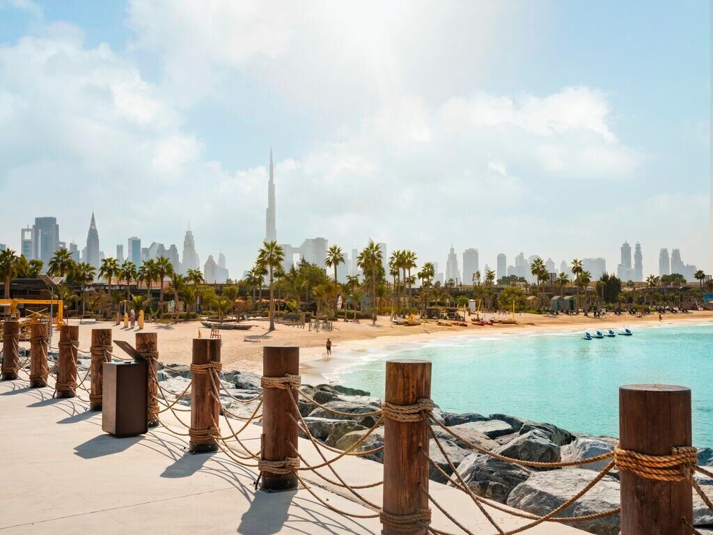

[facebook](https://www.facebook.com/sharer/sharer.php?u=https%3A%2F%2Fwww.natgeo.pt%2Fviagem-e-aventuras%2F2021%2F04%2Fda-quimera-ao-dubai) [twitter](https://twitter.com/share?url=https%3A%2F%2Fwww.natgeo.pt%2Fviagem-e-aventuras%2F2021%2F04%2Fda-quimera-ao-dubai&via=natgeo&text=Da%20quimera%20ao%20Dubai) [whatsapp](https://web.whatsapp.com/send?text=https%3A%2F%2Fwww.natgeo.pt%2Fviagem-e-aventuras%2F2021%2F04%2Fda-quimera-ao-dubai) [flipboard](https://share.flipboard.com/bookmarklet/popout?v=2&title=Da%20quimera%20ao%20Dubai&url=https%3A%2F%2Fwww.natgeo.pt%2Fviagem-e-aventuras%2F2021%2F04%2Fda-quimera-ao-dubai) [mail](mailto:?subject=NatGeo&body=https%3A%2F%2Fwww.natgeo.pt%2Fviagem-e-aventuras%2F2021%2F04%2Fda-quimera-ao-dubai%20-%20Da%20quimera%20ao%20Dubai) [A disseminação global do coronavírus está a afetar os viajantes. Mantenha-se atualizado sobre a explicação científica por trás do surto >>](https://www.natgeo.pt/coronavirus) 

CONTEÚDO PATROCINADO POR 

[Viagem e Aventuras](https://www.natgeo.pt/viagem-e-aventuras) 
# Da quimera ao Dubai 
## Dubai, a cidade dos superlativos, é tudo menos artificial e comum, mas o que a torna única? Fomos à procura da sua identidade. Por [Filipa Coutinho](https://www.natgeo.pt/autor/filipa-coutinho) Publicado 12/04/2021, 10:48 

Dubai é uma cidade de luxuosos arranha-céus, portos e praias. 

Fotografia por Turismo do Dubai **Pronuncia-se Du-bayy.** Pode até confundir-se com outro local quando pisca os olhos e aguarda pelos cocktails servidos à borda da piscina. Pode parecer-lhe que o tilintar dos chamamentos para as orações muçulmanas faz lembrar os sinos de igrejas. Pode ficar nas cadeias de hotéis que já conhece. Pode passear-se na baixa antiga e até recordar-se de outros destinos. Pode com certeza desfrutar de muitos entrepostos culturais, mas no Dubai encontra algo que não encontra em mais lado algum, algo que o catapulta para um universo onírico. 

Esta cidade do Médio Oriente é sumptuosa, futurista, corporativa, inovadora, no entanto, tem um cunho intemporal e valores que permanecem selados nas suas leis e tradições culturais. E é graças a estas benditas leis que a cidade é tão segura e imaculada. No entanto, nem sempre foi assim. 

## **A origem e a perseguição dos portugueses** 
Antes de ser habitável, o Dubai era um mangal e, quando esse pântano secou e se tornou habitável por volta de 6000 a.C., acredita-se que os pastores nómadas da Idade do Bronze foram os primeiros a habitar a zona. É difícil imaginar esta cidade antiga, pouco desenvolvida, baixa e estéril. Esta era a terra onde se trocavam missangas, porcelana, especiarias e têxteis vindos de outros lugares. Este fervoroso comércio e a sua posição estratégica começaram a atrair as potências europeias e a facilitar a interação de culturas. Em 1498, Ahmad Ibn Majid, um marinheiro de Omã, ajudou Vasco da Gama a navegar no Estreito de Ormuz. Os navegadores portugueses aproveitaram esse conhecimento para anexar a Ilha de Socotra no Iémen, ocupando Omã e colonizando o Bahrein. 

Certas partes da cidade têm o poder de nos transportar para uma realidade mais antiga. 

Fotografia por Turismo do Dubai Mais tarde, nos séculos XVII e XVIII, os portugueses foram perseguidos por franceses e holandeses, que compreenderam o valor estratégico da costa do Golfo e da proteção das suas próprias rotas comerciais para o leste. Contudo, foram os ingleses quem mais conseguiu reivindicar o futuro da região, assegurando as rotas comerciais para a Índia e mantendo a terra protegida dos turcos e Persas. Em troca da proteção britânica, os xeques locais renunciaram toda a jurisdição dos seus negócios estrangeiros. 

Em 1833, uma tribo de Abu Dhabi derrubou a cidade do Dubai, estabelecendo a dinastia Al Maktoum, que ainda governa o emirado do Dubai. Ao longo do século XIX a vila era um enclave de pescadores, mergulhadores de pérolas, beduínos e mercadores indianos e persas. Foi o xeque Maktoum Bin Hasher Al Maktoum que no século XIX levou o Dubai ao palco internacional, concedendo isenção de impostos aos comerciantes estrangeiros e fixando o Dubai como um porto franco, distinguindo-se dos seus rivais. Nessa altura, uma onda de trabalhadores estrangeiros invadiu a cidade (e assim continua). 

Quando Inglaterra anunciou a sua saída da região em 1968, o governante de Abu Dhabi assumiu a liderança através da formação de alianças e em 1971, nasceram os Emirados Árabes Unidos (EAU) – constituídos por Dubai, Abu Dhabi, Ajman, Fujairah, Sharjah e Umm Al-Quwain; Ras Al Khaimah juntou-se dois meses depois. Em apenas meio século o Dubai tornou-se uma metrópole inovadora com uma arquitetura atraente e economicamente poderosa. 

## **A cidade onde tudo é possível** 
O Dubai passou de uma zona pobre e pequena, para uma cidade de sonho. A transformação foi célere e voraz. Rapidamente as praias selvagens tornaram-se referências, com ar condicionado até nos estacionamentos. A construção destemida e os hotéis que fazem lembrar cenários de ‘As Mil e Uma Noites’ continuam a encantar, mas já não são inusitados. As ilhas visíveis do espaço e as pistas de esqui dentro de um centro de comercial não são invulgares. Invulgar é a velocidade com que os sonhos se distanciam da concretização. Nas palavras de Mohammed bin Rashid Al Maktoum, vice-presidente e primeiro ministro dos EAU, “na vida não há impossíveis”. 

As igrejas e os templos hindus coabitam com mesquitas. As festas extravagantes convivem com as restrições de álcool e outros “limites”. As regras coabitam com a invulgar complacência acerca da religião, ao contrário dos seus vizinhos. A sociedade islâmica tolerante e diplomaticamente neutra é um modelo para a região. O governo combina progressão e tradição como poucas nações. 

A população está em constante _“refresh”_ , com muitos residentes imigrantes em formato _short-term_ – apenas cerca de 10% dos residentes são cidadãos dos EAU. A cidade abraça uma cultura coerente que tem a capacidade de acolher pessoas com um ADN cultural muito diverso. 

Esta cidade é também uma extensa ementa de destinos para todos os gostos, à distância de apenas um voo. Na opinião de Mohammed bin Rashid Al Maktoum, “o que nos orgulha na nossa nação não é a altura dos nossos edifícios, a largura das nossas ruas ou a magnitude dos nossos centros comerciais, mas sim a abertura e a tolerância da nossa nação. O nosso orgulho vem do facto de sermos um país onde todos prosperam igualmente, independentemente das suas diferenças.” 

## Veja estas atrações imperdíveis no Dubai 

ver galeria 
## **Sustentabilidade aos molhos** 
O Dubai dá passos ousados em direção a um mundo mais consciente, afastando-se da abundância de outros tempos. A cidade não esconde a sua ambição: há pouco mais de dez anos possuía uma das mais pesadas pegadas ambientais, mas em 2050 pretende ter uma das mais leves. 

E a cidade já começou a mudar. Na periferia foi criado um complexo habitacional chamado [Cidade Sustentável](https://www.thesustainablecity.ae/) , que recicla a sua água e resíduos e produz mais energia do que consome. O futuro da região passará certamente a ser sustentado pela energia solar. No deserto, o Dubai está a construir uma gigantesca central de energia solar que em breve produzirá uma das energias mais económicas e mais limpas do planeta. O deserto está a ser florestado muito além da plantação e manutenção das árvores: estão a nascer oásis sustentáveis. 

A sua identidade continuará a ser contornada por rios e lagos artificiais. Este cenário não é difícil de imaginar numa região em que a terra frequentemente se “transforma” em água e a água em terra. E quando as ideias escassearem, o Dubai irá reinventar-se como poucas cidades conseguem. A [Expo de 2020](https://www.expo2020dubai.com/) , adiada devido à pandemia, promete trazer experiências inesquecíveis de 1 de outubro de 2021 a 31 de março de 2022, onde serão anunciadas soluções para o novo mundo. 

Ir ao Dubai e não subir a um arranha-céus é equivalente a um sacrilégio. 

Fotografia por Elmer Magallanes , Turismo do Dubai 
## **Um destino para todos os devaneios** 
Comece por informar-se sobre a política de testes para a COVID-19 do Dubai. Tem de possuir seguro de saúde durante a sua estadia no Dubai e preencher alguns documentos relacionados com o seu estado de saúde. 

No Aeroporto Internacional do Dubai, por onde habitualmente passam quase 100 milhões de passageiros todos os anos, o cenário é imaculado e a tentação de sair entre ligações aéreas é grande. Quer procure praia ou deserto, uma pista de esqui, ou até pirâmides de Gisé, no Dubai encontra resposta para todos os desejos. No Dubai tudo é possível. Mas afinal o que o distingue? Talvez a sua beleza singular seja encontrar todas as respostas num único local, uma cidade privilegiada, uma cidade mágica que consegue satisfazer os seus desejos mais exóticos. 

Quando se fala em Dubai frequentemente são utilizadas palavras como moderno e luxuoso, mas também artificial e comum. O Dubai não é artificial nem comum, é novo, com apenas 50 anos de existência enquanto cidade. Não, não podíamos estar em mais lado algum – isso só pode (ousadamente) ser dito por quem nunca cruzou as ruas velhas e novas do Dubai. 

Não há nada que satisfaça como o sabor característico das viagens. É difícil trocar o aroma de uma praia nova ou de um quarto de hotel acabado de preparar. Poupamos-lhe a inveja e convidamo-lo a descobrir por si. Afinal, o Dubai está ao virar de muitas esquinas. 

Este conteúdo é-lhe trazido pelo nosso parceiro. Não reflete necessariamente a visão da National Geographic ou da sua equipa editorial. 