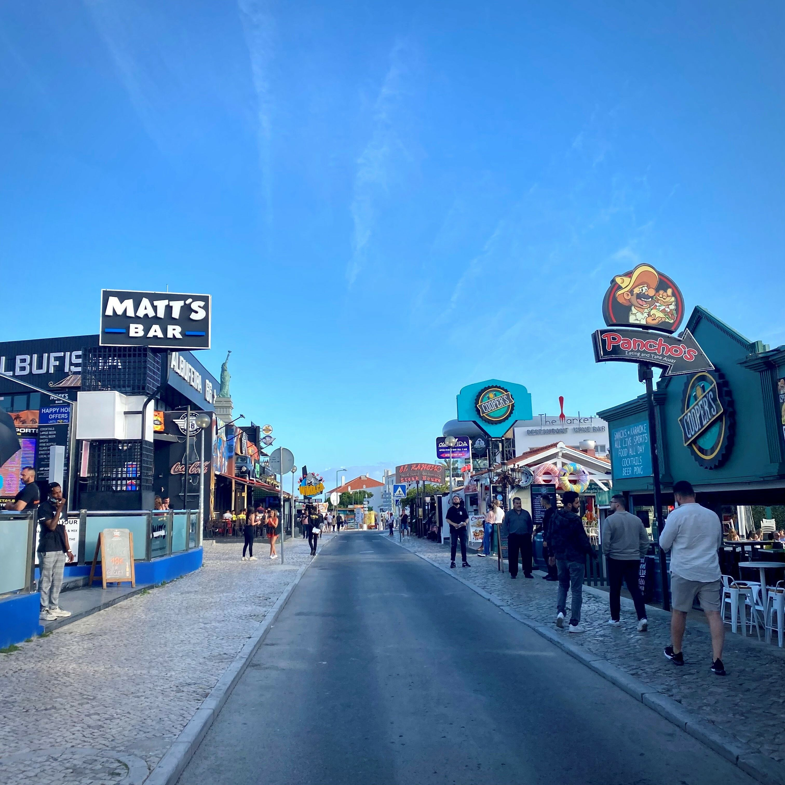
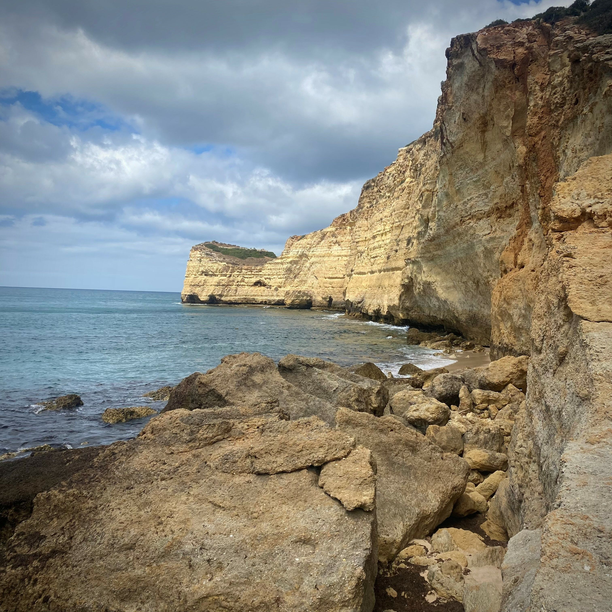
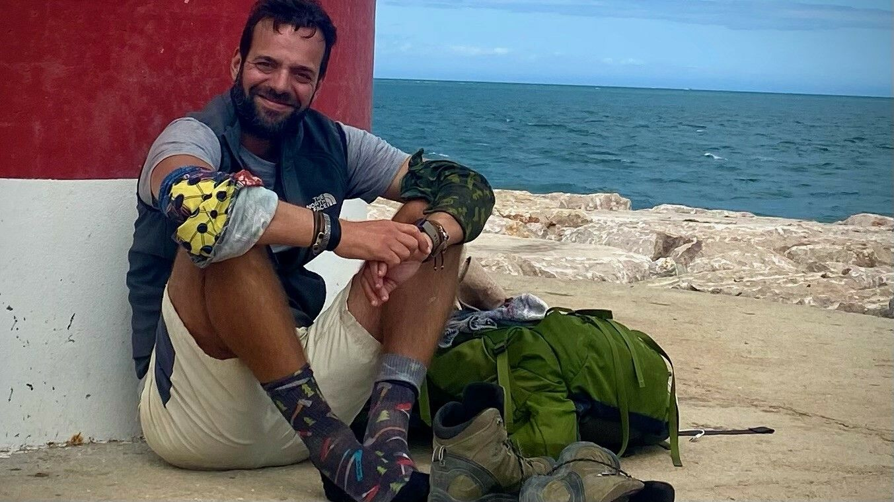

[facebook](https://www.facebook.com/sharer/sharer.php?u=https%3A%2F%2Fwww.natgeo.pt%2Fviagem-e-aventuras%2F2021%2F12%2Fandre-rocha-caminhada-costa-continental-portuguesa) [twitter](https://twitter.com/share?url=https%3A%2F%2Fwww.natgeo.pt%2Fviagem-e-aventuras%2F2021%2F12%2Fandre-rocha-caminhada-costa-continental-portuguesa&via=natgeo&text=Andr%C3%A9%20Rocha%20percorreu%20a%20p%C3%A9%20a%20costa%20continental%20portuguesa%20de%20uma%20ponta%20%C3%A0%20outra) [whatsapp](https://web.whatsapp.com/send?text=https%3A%2F%2Fwww.natgeo.pt%2Fviagem-e-aventuras%2F2021%2F12%2Fandre-rocha-caminhada-costa-continental-portuguesa) [flipboard](https://share.flipboard.com/bookmarklet/popout?v=2&title=Andr%C3%A9%20Rocha%20percorreu%20a%20p%C3%A9%20a%20costa%20continental%20portuguesa%20de%20uma%20ponta%20%C3%A0%20outra&url=https%3A%2F%2Fwww.natgeo.pt%2Fviagem-e-aventuras%2F2021%2F12%2Fandre-rocha-caminhada-costa-continental-portuguesa) [mail](mailto:?subject=NatGeo&body=https%3A%2F%2Fwww.natgeo.pt%2Fviagem-e-aventuras%2F2021%2F12%2Fandre-rocha-caminhada-costa-continental-portuguesa%20-%20Andr%C3%A9%20Rocha%20percorreu%20a%20p%C3%A9%20a%20costa%20continental%20portuguesa%20de%20uma%20ponta%20%C3%A0%20outra) [A disseminação global do coronavírus está a afetar os viajantes. Mantenha-se atualizado sobre a explicação científica por trás do surto >>](https://www.natgeo.pt/coronavirus) 

[Viagem e Aventuras](https://www.natgeo.pt/viagem-e-aventuras) 
# André Rocha percorreu a pé a costa continental portuguesa de uma ponta à outra 
## André Rocha propôs-se a caminhar do ponto litoral mais a norte de Portugal até Vila Real de Santo António, passando por todas as praias do país numa extraordinária odisseia de 19 dias. Por [Filipa Coutinho](https://www.natgeo.pt/autor/filipa-coutinho) Publicado 3/12/2021, 08:55 

André Rocha prestes a chegar ao final da grande jornada, ao quilómetro 948. 

Fotografia por André Rocha Há algo de divino e, ao mesmo tempo, tremendamente congénito, no ato de caminhar. Em Portugal, existem trajetos para todos os gostos e ritmos, alguns bem mais acessíveis e (felizmente) inclusivos que outros. Há também caminhantes de todos os tipos, dos mais rotineiros aos mais arrojados. Depois existe quem não siga um rumo trivial. 

André Rocha, estudou em algumas das mais prestigiadas universidades do mundo, é gestor, docente universitário de liderança e sustentabilidade corporativa na Porto Business School e fundador do [The Escapist](https://www.instagram.com/theescapist______/) , um projeto que promove expedições em locais remotos. É declaradamente apaixonado por caminhadas e aventuras. E foi essa devoção que o imergiu numa desafiante jornada a solo no início do verão passado. 

Passo a passo, André Rocha, percorreu todos os areais, falésias, marginais e escarpas da costa continental portuguesa. Em 19 dias, fez os estrondosos 961 quilómetros da linha litoral num trajeto que apelidou de [Route 76](https://www.instagram.com/the_route76/) . Do desafio pode nascer uma nova grande rota pedestre. 

**Como é que decide fazer esta aventura tão desafiante?** 

Conjugaram-se vários fatores, sem que possa indicar o prevalecente. Primeiro: andar, e a velocidade natural que daí decorre, tornou-se há muito tempo um bem necessário e a vontade de o estender pelo máximo tempo possível é constante e irreprimível. Em segundo lugar, a ideia de estender a possibilidade de andar por um terreno que me é familiar, mas não totalmente conhecido, trazia um apelo muito específico, uma vez que conhecer Portugal em câmara lenta e passo a passo era um sonho antigo, sobretudo por adivinhar a sequência cénica que seria ter a memória de toda a nossa costa litoral. Por fim, em função da crescente procura (de natureza global) por rotas pedestres e tendo em conta os bons e fortes passos que se têm dado em Portugal na sua promoção, gostaria de saber até que ponto seria fazível a marcação de uma grande rota pedestre por todo o nosso litoral, criando um roteiro de natureza nacional (e não temática ou regional): e, de facto, além de possível, é uma aventura magnífica. 

Praia Atlântida de Tróia, quilómetro 572. 

Fotografia por André Rocha **Caminhar é uma forma de contrabalançar o ritmo intenso do dia-a-dia?** 

O ato de caminhar tem, para mim, uma importância em termos absolutos e relativos. Em termos absolutos, porque sendo porventura um dos nossos gestos fisiológicos mais repetidos e intrínseco à nossa identidade enquanto espécie, tornou-se uma necessidade em nome próprio. Quando ando em longos percursos, o processo físico e intelectual ganha um perfil diferente, sendo porventura a única situação em que o primeiro se impõe e prevalece face ao segundo. Em termos relativos porque, em função do sobre uso da nossa função intelectual determinada pelo modo de vida que levamos e as exigências que nos são feitas, aquele contrabalanço de deixarmos as necessidades e resistências do nosso corpo comandarem a nossa mente inquieta, permite-me regenerar e descansar todo o meu processo intelectual: o ato de andar funciona como férias para o processo mental, porque o deixa secundado e subsidiário daquilo que o corpo pode, quer ou consegue fazer. 

### “Foi, sobretudo, um processo de entretenimento puro e 
do reconhecimento do privilégio que é fazer o que fiz” **Quando se viaja a solo cede-se mais espaço ao acaso e à catarse. Teve boas surpresas durante o percurso?** 

O processo de catarse é um processo muito individual e conjuntural. Nesta rota, seja por ter já andado muito sozinho antes de a fazer, seja pela conjuntura em que a fiz, não fui assolado por nenhum processo de epifania interna. Foi, sobretudo, um processo de entretenimento puro e do reconhecimento do privilégio que é fazer o que fiz, e ter uma estrada quase interminável sempre à minha frente, com o vento a bater-me nas costas. Quanto ao acaso a resposta é outra: o acaso e o imprevisto são os ingredientes principais (e mais especiais) de uma viagem deste género. Será impossível alguém ter uma viagem igual à minha e cada um de nós terá acesso aos seus fatores: seja a meteorologia e a luz que vai acompanhar cada um dos seus dias de caminho, sejam as pessoas com quem nos cruzamos e com quem nos apetece conversar, seja a altura ou o sítio onde nos apetece parar. Sendo todos estes momentos consequências do acaso, as surpresas que temos são intermináveis. No meu caso, a surpresa acontecia sempre, cada passo novo era um sítio diferente e uma perspetiva mudada, sempre rumo a sudeste. 

**Esquerda:** **Superior:** Praia dos Três Irmãos (Alvor), quilómetro 817. 

**Direita:** **Inferior:** Carvoeiro (Faro), quilómetro 833. 

fotografias de André Rocha **Além da superação física, quais foram os maiores desafios que enfrentou no terreno?** 

Apesar de o nosso processo intelectual estar relativamente domado durante os dias de caminhada, são muitas as alturas em que nos apetece parar, independentemente de qualquer limitação física que possa haver. O nosso litoral é longo, e quando nos deixamos parar para pensar que ainda nos faltam andar 400 ou 500 quilómetros sozinhos e que basta um “chega” para pormos fim a uma série de pequenos sofrimentos diários, a tentação aparece. A liberdade de poder desistir é, sem dúvida, a grande tentação e desafio a vencer. Como qualquer liberdade, também esta é muitíssimo sedutora e pode rapidamente curvar-nos ao encanto que nos mostra. No meu caso concreto, essa sereia começava a falar-me ao ouvido pelas 16h00 dos dias de caminho e prolongava-se até parar. E não houve um único dia em que não tenha aparecido. 

**Numa linha costeira tão variada como a portuguesa, o que mais o encantou?** 

Em termos metafóricos, vi a nossa costa como uma sequência de um filme. A costa representa um processo complementar, uma vez que se entrelaça em paisagens e recortes diferentes, sendo quase impossível de acreditar que a praia de Moledo, a da Adraga ou a da Carrapateira ficam no mesmo país, a tão poucas centenas de quilómetros entre si. Mais do que identificar o ponto A ou B, encantou-me a diversidade de um país tão eclético e tão cénico, condensando tanta diversidade, cultura, bravura e esplendor em apenas 961 quilómetros de costa. 

**Esquerda:** **Superior:** Praia da Vigia, quilómetro 447. 

**Direita:** **Inferior:** Praia da Amália (Odemira), quilómetro 692. 

fotografias de André Rocha **Esta grande rota pedestre é a prova de que não é necessário ir muito longe para encontrar aquilo que muitas vezes se procura lá fora...** 

A aventura está mesmo ao nosso lado, a passos de distância. Vivemos quotidianamente em zonas geográficas muito apertadas, num triângulo casa – trabalho – comunidade: e nem mesmo esse território é sempre totalmente conhecido. Se nos aventurarmos a sair desse triângulo com tudo o que precisarmos ao ombros, a previsibilidade e a rotina são imediatamente substituídos pela surpresa e o assombro da descoberta, e sobretudo pela liberdade de uma boa aventura, onde comandamos os nossos destinos durante o tempo que entendermos. Só precisamos mesmo de por todas as nossas desculpas de lado e começar a andar, seja em que direção for. 

André Rocha à chegada à foz do Guadiana, onde terminou a sua jornada de 19 dias ao longo do litoral continental. 

Fotografia por André Rocha 

**Esquerda:** **Superior:** Praia do Rei Cortiço (Óbidos), quilómetro 361. 

**Direita:** **Inferior:** Praia da Oura (Albufeira), quilómetro 865. 

fotografias de André Rocha **O que levou na mochila para estes 19 dias?** 

Dois calções, uns calções de banho, três t-shirts, um polar, um impermeável, quatro pares de meias de caminhada de lã, um canivete suíço, artigos de higiene e de primeiros socorros, um telemóvel, um livro do Erling Kagge e o computador. 

**Qual foi o processo para planear esta rota?** 

Tentar adivinhar a distância total da costa (processo que foi redondamente falhado) e dividi-la pelo número de dias disponível para a fazer. Incrivelmente, um planeamento tão rudimentar acabou por funcionar em pleno. 

**Qual a sua opinião sobre _bucket lists_ ?** 

Um branqueamento de consciência e uma ferramenta de autoconvencimento. Prefiro infinitamente as histórias contadas sobre coisas já feitas do que as esperanças em coisas que podemos nunca fazer. 

**Já tem a próxima aventura planeada?** 

Muito pensada, planeada e já toda sonhada: mas para já ainda é só parte de uma _bucket list_ . Falo dela quando a fizer! 

